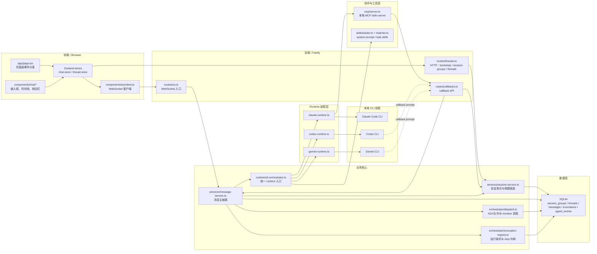
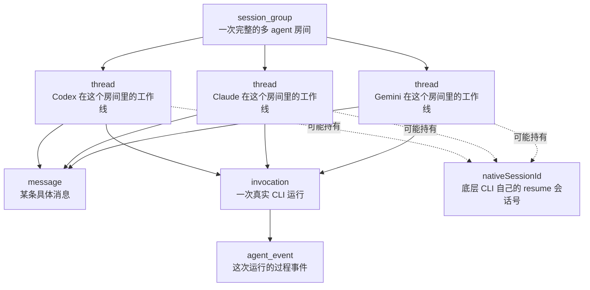
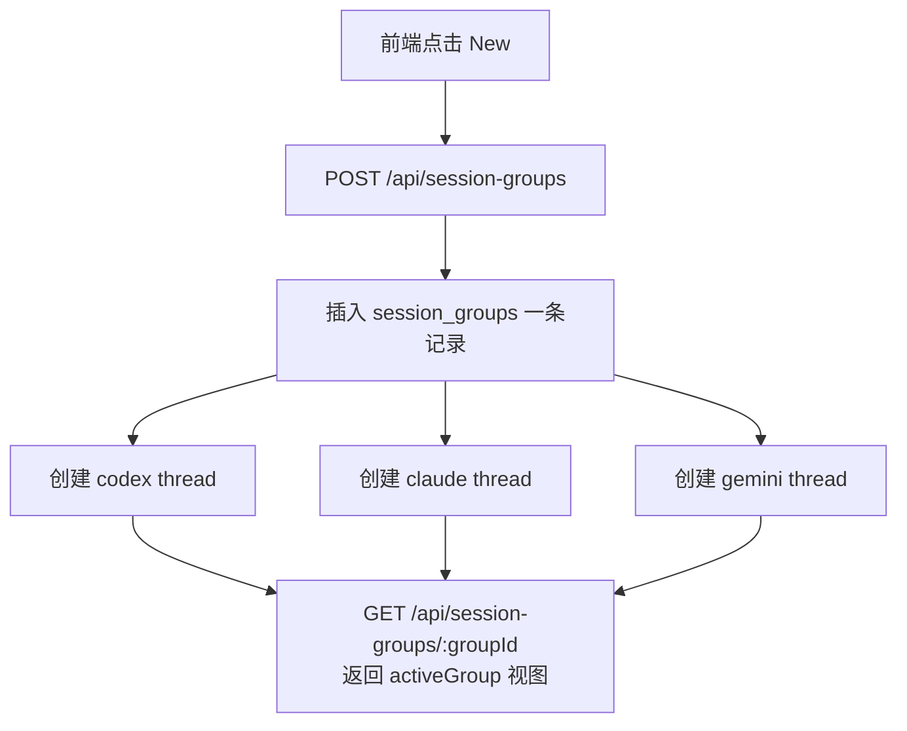
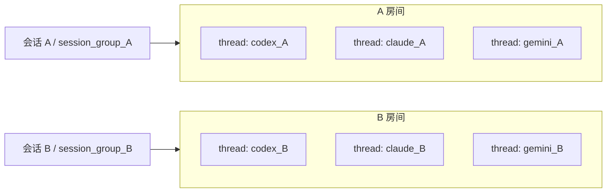
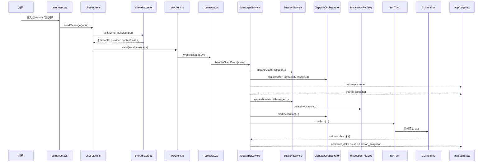
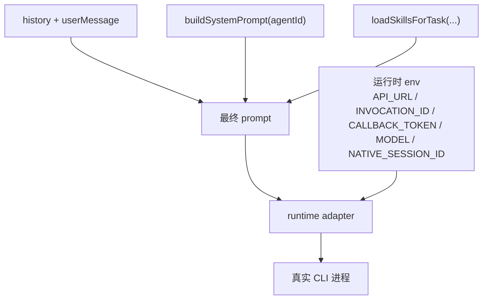
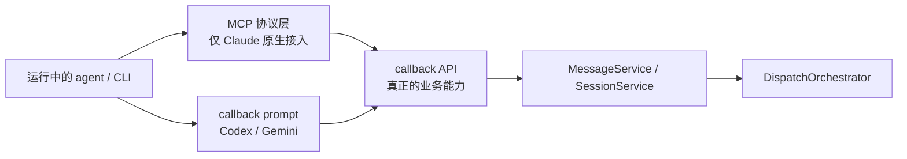
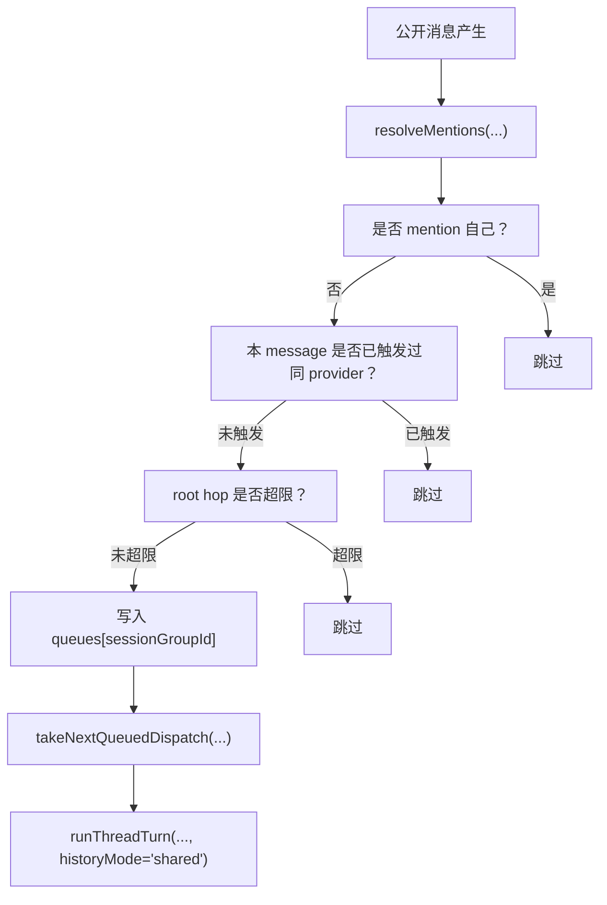
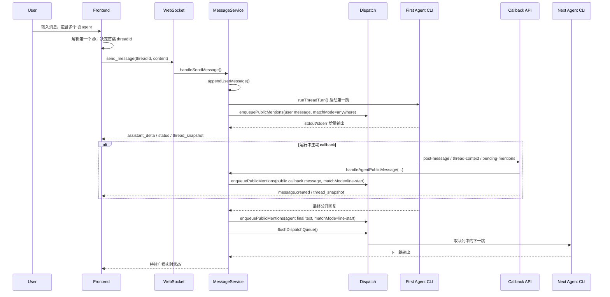

# Multi-Agent 架构文档

这份文档不是泛泛而谈的“概念介绍”，而是直接对照当前代码，把系统里最容易混淆的几件事讲清楚：

1. 前端、后端、CLI、MCP、callback API、A2A 分别在哪一层。
2. `session group`、`thread`、`message`、`invocation` 在代码里各代表什么。
3. 新建一个会话和继续使用原会话，在技术上到底有什么区别。
4. 当前会话正在进行时，能不能再新建一个会话跑别的任务。

---

## 一句话结论

这个项目现在已经不是“一个页面分别调用三个 CLI”，而是一个真正有调度层的多 agent orchestrator：

- 前端负责输入、展示、状态同步。
- 后端负责调度、持久化、callback、A2A、MCP 桥接。
- CLI 只是被 runtime 统一拉起的执行端。
- `session group -> threads -> messages -> invocations -> agent_events` 才是整个系统真正的骨架。

---

## 1. 一张架构图先看全局



### 这张图要记住的重点

- 前端不直接调 CLI，前端只调 Fastify。
- `MessageService` 是消息链路的主入口，不是 `routes/ws.ts`。
- `DispatchOrchestrator` 决定 A2A 怎么排队，不是 runtime 决定。
- `InvocationRegistry` 管的是“这一次运行的临时身份”，不是“整个会话”。
- Claude 走原生 MCP，Codex / Gemini 当前走 callback prompt 注入，但最终都落到同一套 callback API。

---

## 2. 先把五个最重要的对象讲清楚

很多概念之所以容易混，是因为它们在中文里都容易被叫成“会话”“消息”“任务”。但代码里它们不是一回事。



### 2.1 `session_group`

代码位置：

- `SessionRepository.createSessionGroup()`
- `SessionService.createSessionGroup()`
- 表：`session_groups`

它表示：

**一个完整的协作房间。**

一个 `session_group` 下面会自动创建 3 条 `thread`，分别给 `codex`、`claude`、`gemini`。

### 2.2 `thread`

代码位置：

- `threads` 表
- `ProviderThreadRecord`
- `SessionService.findThreadByGroupAndProvider()`

它表示：

**某个 provider 在某个房间里的单独工作线。**

要特别注意：这里的 `thread` 不是操作系统线程，也不是 WebSocket 线程。

在这个项目里，`thread` 的意思是：

- 一个 agent 的上下文线
- 一条消息归属线
- 一个 `nativeSessionId` 的挂载点

### 2.3 `message`

代码位置：

- `messages` 表
- `appendUserMessage()`
- `appendAssistantMessage()`

它表示：

**一条具体消息。**

一条消息只属于一个 `thread`。

### 2.4 `invocation`

代码位置：

- `InvocationRegistry`
- `invocations` 表
- `MessageService.runThreadTurn()`

它表示：

**某一个 agent 被真正拉起执行的一次运行实例。**

例如：

- 用户 `@黄仁勋` 发起一次 Claude 运行
- A2A 链路里再自动拉起一次 Codex 运行

这两次就是两个不同的 `invocation`。

### 2.5 `agent_event`

代码位置：

- `agent_events` 表
- `events.emit({ type: "invocation.activity", ... })`

它表示：

**某次 invocation 过程中的活动日志。**

不是聊天消息，不直接显示在普通时间线里，而是给调试、状态判断、可观测性用的。

---

## 3. 新建会话，到底创建了什么

这个问题很关键，因为“新建一个会话”和“继续在当前会话里说话”在系统内部不是同一种操作。

### 3.1 创建流程

当前前端点左侧 `New` 按钮时，会调用：

- `components/chat/session-sidebar.tsx`
- `useThreadStore().createSessionGroup()`

前端随后调用：

- `POST /api/session-groups`

后端链路是：

1. `routes/threads.ts` 接收 `POST /api/session-groups`
2. `SessionService.createSessionGroup()`
3. `SessionRepository.createSessionGroup()`
4. `SessionRepository.ensureDefaultThreads(...)`

也就是说，新建会话不是只插入一条 `session_groups` 记录，它还会立刻补齐该房间下的默认线程。

### 3.2 技术上新建会话会生成什么



新建一个会话后，系统会得到一整套新的隔离对象：

- 一个新的 `sessionGroupId`
- 三个新的 `threadId`
- 三条新的 provider 工作线
- 三个新的 `nativeSessionId` 挂载位，初始都是 `null`
- 一条新的时间线视图 `activeGroup`

### 3.3 它和之前的会话有什么区别

区别不在“UI 看起来像是开了个新房间”，而在于它在数据和调度上是新的一套边界。

| 对比项 | 继续用原会话 | 新建会话 |
| --- | --- | --- |
| `sessionGroupId` | 不变 | 新建一个 |
| 三个 `threadId` | 继续复用原来的 | 全部新建 |
| 历史消息 | 继续接在原 timeline 上 | 从空房间开始 |
| `nativeSessionId` | 可能复用原 CLI 会话，支持 resume | 初始为空，需要重新建立 |
| A2A 队列 | 继续沿用原会话组队列 | 新开一条会话组队列 |
| `rootMessageId` 链路 | 接在原房间消息树上 | 从新房间里重新开始 |
| 停止按钮影响范围 | 只影响当前 thread 的当前 invocation | 只影响新房间对应 thread |

一句话：

**新建会话不是“把页面清空”，而是新建一套 `session_group + 3 threads + 后续消息链`。**

---

## 4. 当前会话进行中，能不能再新建一个会话做别的任务

### 4.1 后端能力层面：可以

从后端实现看，答案是：

**可以，而且是被当前架构允许的。**

原因有三个。

#### 第一，运行锁是按 `threadId` 做的，不是按全局 provider 做的

`MessageService.runThreadTurn()` 里拦截的是：

- `this.invocations.has(thread.id)`

不是：

- “Claude 全局只能跑一个”
- “整个系统一次只能跑一个”

所以技术上允许：

- 会话 A 里的 Claude 在跑
- 会话 B 里的 Claude 也再跑一个

因为它们是两个不同的 `threadId`。

#### 第二，A2A 队列是按 `sessionGroupId` 分开的

`DispatchOrchestrator` 里维护的是：

- `queues: Map<string, QueuedDispatch[]>`

key 是 `sessionGroupId`。

这意味着：

- 会话 A 的 A2A 接力不会塞进会话 B 的队列
- 会话 B 的 hop 计数也不会污染会话 A

#### 第三，串行限制只发生在“同一个会话组内部”

`takeNextQueuedDispatch(sessionGroupId, runningThreadIds)` 会检查：

- 当前 `sessionGroupId` 下面是否还有 thread 在运行

如果有，就先不触发下一跳。

这条限制是：

**同房间串行。**

不是：

**全系统串行。**

### 4.2 当前实现下的真实结论



技术上当前允许的并发：

- 会话 A 跑 Claude，同时会话 B 跑 Codex
- 会话 A 跑 Claude，同时会话 B 也跑 Claude
- 同一个会话组里，用户手动再点另一个 provider，也可以启动另一条 `thread`
- 会话 A 空闲时，A 内部再串行接 A2A 下一跳

不允许的并发：

- 同一个 `threadId` 上重复启动第二次运行
- 同一个会话组里 A2A 队列无序并发冲出去

### 4.3 但前端展示层面，当前还有一个重要限制

这里要非常诚实地写清楚：

**后端允许跨会话并发，但当前前端页面状态仍然更接近“单活动房间视图”。**

原因在于：

- `app/page.tsx` 收到任何 `thread_snapshot` 都直接 `replaceActiveGroup(event.payload.activeGroup)`
- 收到任何 `message.created` 都直接 `appendTimelineMessage(...)`
- 收到任何 `assistant_delta` 都直接 `applyAssistantDelta(...)`

当前页面没有先判断：

- 这条事件是不是当前 `activeGroupId`
- 这条消息是不是当前正在看的会话组

这意味着如果你在**同一个页面实例**里同时让多个会话组都跑起来，当前 UI 可能出现这些表现：

- 时间线被另一个会话组的快照覆盖
- 顶部状态栏显示的是别的房间的状态
- 你明明在看会话 A，但突然刷进会话 B 的更新

### 4.4 所以这个问题的准确回答应该怎么说

准确答案不是简单的“能”或者“不能”，而是：

1. 后端和数据模型上，能。
2. 调度层上，能，并且不同会话组互相隔离。
3. 当前前端展示层还没有把 WebSocket 事件按 `sessionGroupId` 做过滤，所以同页面并发多会话时，UI 还不完全隔离。

也就是说：

**架构已经支持“后台并发开新会话做别的任务”，但当前页面层还没有把这种并发体验完全做成稳定的多房间实时视图。**

---

## 5. 前后端调用链，详细到事件级别

这一节只讲“用户发一条消息，到底怎么穿过前后端”。



### 5.1 前端发出的是什么

前端发的不是“随便一段文本”，而是 `RealtimeClientEvent`。

代码定义：

- `packages/shared/src/realtime.ts`

当前前端真正发送的是：

```ts
{
  type: "send_message",
  payload: {
    threadId,
    provider,
    content,
    alias
  }
}
```

这些字段里最容易误解的是：

- `provider`: 内部固定 ID，只可能是 `codex | claude | gemini`
- `alias`: 展示给用户看的名字，比如“黄仁勋”
- `threadId`: 目标 provider 在当前房间里的工作线 ID

### 5.2 后端回推的是什么

后端回推的是 `RealtimeServerEvent`，核心有四种：

| 事件名 | 谁发出 | 作用 |
| --- | --- | --- |
| `assistant_delta` | `MessageService` | 往某个 assistant 气泡继续追加文本 |
| `message.created` | `MessageService` / callback 路由 | 告诉前端“新消息已经落地了” |
| `thread_snapshot` | `MessageService` / callback 路由 | 推一份当前 `activeGroup` 完整快照 |
| `status` | `MessageService` / WebSocket 生命周期 | 更新顶部短状态 |

### 5.3 为什么既要 `assistant_delta` 又要 `thread_snapshot`

因为它们解决的是两个不同的问题。

`assistant_delta` 解决：

- 流式打字机效果
- 用户能立刻看到生成中的内容

`thread_snapshot` 解决：

- 前后端状态重新对齐
- callback 消息落库后全量刷新
- CLI 结束后把数据库里的最终状态同步回来

一句话：

- `delta` 是“过程流”
- `snapshot` 是“对账流”

---

## 6. runtime 层，到底统一了什么

### 6.1 为什么一定要有 runtime

如果没有 runtime，业务层就得直接知道：

- Claude 命令怎么拼
- Codex 走什么参数
- Gemini 怎么 resume
- 哪家走 MCP，哪家走 callback prompt

这会导致：

- service 层掺杂大量 CLI 细节
- 扩展新的 provider 时改动面很大
- 调试时不知道 bug 到底在“业务链路”还是“命令拼装”

### 6.2 当前 runtime 的统一输入

代码位置：

- `packages/api/src/runtime/base-runtime.ts`
- `packages/api/src/runtime/cli-orchestrator.ts`

统一输入对象叫：

- `AgentRunInput`

它在代码里的意思是：

**上层已经把这次运行整理成了一份标准任务单，runtime 只负责把它翻译成真实 CLI 命令。**

### 6.3 `runTurn()` 实际做了什么

`runTurn()` 不是直接跑命令那么简单，它在启动 CLI 前还会做三件重要的事：

1. 组装 prompt 历史
2. 注入 system prompt 和 task skill
3. 把 callback 身份、模型、native session 信息塞进环境变量



### 6.4 `nativeSessionId` 在代码里是什么

它不是平台层的会话组 ID。

它在代码里表示：

**底层某家 CLI 自己返回的 resume 会话号。**

挂载位置：

- `threads.native_session_id`
- `ProviderThreadRecord.nativeSessionId`

作用：

- 下次同一个 `thread` 再运行时，可以让底层 CLI 走 `resume`
- 这样就不是每一轮都完全从零开始

---

## 7. callback API、MCP、A2A 之间是什么关系

这三个词最容易被混在一起，但它们不是一层东西。



### 7.1 callback API 是业务能力层

代码位置：

- `packages/api/src/routes/callbacks.ts`

当前提供三类能力：

- `POST /api/callbacks/post-message`
- `GET /api/callbacks/thread-context`
- `GET /api/callbacks/pending-mentions`

它们才是“agent 主动参与协作”的真正业务入口。

### 7.2 MCP 是协议层，不是业务层

代码位置：

- `packages/api/src/mcp/server.ts`

当前这个 MCP server 并不直接查数据库，它只做三件事：

1. 从环境变量读取这次 invocation 的身份
2. 把 Claude 的工具调用翻译成 HTTP 请求
3. 调 callback API

所以要记住：

- `callback API` = 业务能力
- `MCP server` = 协议适配器

### 7.3 Codex / Gemini 为什么没走原生 MCP

当前实现里：

- `claude-runtime.ts` 会为每次 invocation 生成临时 MCP 配置文件
- `codex-runtime.ts` / `gemini-runtime.ts` 通过 `buildCallbackPrompt(...)` 把 callback 调用说明塞进 prompt

这代表的不是“能力不同”，而是“接入方式不同”。

结果上三家都能做到：

- 读上下文
- 发公开消息
- 触发后续协作

只是 Claude 是原生 tool call，Codex / Gemini 目前是 prompt 驱动调用。

---

## 8. A2A 详细解释：代码里到底怎么让 agent 互相叫人

A2A = agent-to-agent。

在当前代码里，它不是“两个 CLI 彼此建连接”，而是：

**公开消息 -> mention 解析 -> 入队 -> 下一跳 runtime**

### 8.1 触发入口

代码位置：

- `DispatchOrchestrator.enqueuePublicMentions(...)`

它会处理三类公开文本里的 mention：

- 用户消息里的 `@agent`
- callback `post-message` 发出的公共消息里的 `@agent`
- agent 最终回答里的 `@agent`

### 8.2 队列里存的不是“原消息”，而是“下一跳任务单”

`QueuedDispatch` 里保存的是：

- `sessionGroupId`
- `rootMessageId`
- `sourceMessageId`
- `sourceProvider`
- `targetProvider`
- `content`

这里最重要的是 `rootMessageId`。

它在代码里的意义是：

**把整条协作链串成同一个 root，后续 hop 限制、去重、追踪都围绕它计算。**

### 8.3 A2A 流程图



### 8.4 为什么要有 hop 限制和去重

因为如果没有这两个东西，就很容易出现：

- A `@B`
- B `@A`
- A 再 `@B`

然后整条链路无限 ping-pong。

当前代码里的保护包括：

- `MAX_HOPS = 10`
- 单条 message 对同一 provider 去重
- 同会话组按队列串行触发下一跳

### 8.5 为什么当前 A2A 是串行，不是并发

`takeNextQueuedDispatch(...)` 会先检查：

- 同一个 `sessionGroupId` 下面是否已有 thread 在运行

只要还有运行中的 thread，就先不发下一跳。

这么设计的目标不是炫技，而是为了：

- 共享上下文更稳定
- 时间线更好理解
- hop 关系更好追踪

第一版追求的是：

**可解释的接力协作。**

不是：

**黑箱式全并发群聊。**

---

## 9. 术语表：名词和代码对象一一对应

这一节专门回答“某个名词在代码中到底代表什么”。

| 名词 | 代码对象 / 类型 | 主要位置 | 在项目里代表什么 |
| --- | --- | --- | --- |
| provider | `Provider` | `packages/shared/src/constants.ts` | 固定内部 ID，只能是 `codex` / `claude` / `gemini` |
| alias | `PROVIDER_ALIASES`、`thread.alias` | `constants.ts`、`threads` 表 | 给用户看的显示名，例如“黄仁勋” |
| session group | `session_groups` 表、`SessionGroupSummary` | `session-repository.ts`、`realtime.ts` | 一次完整多 agent 房间 |
| thread | `ProviderThreadRecord`、`threads` 表 | `db/sqlite.ts` | 某个 provider 在某个房间里的工作线 |
| message | `MessageRecord`、`TimelineMessage` | `db/sqlite.ts`、`realtime.ts` | 一条具体消息 |
| activeGroup | HTTP / WS 返回的视图模型 | `SessionService.getActiveGroup()` | 前端当前正在渲染的房间快照 |
| rootMessageId | `DispatchOrchestrator.messageRoots` | `dispatch.ts` | 一整条协作链的根 ID |
| invocation | `InvocationIdentity`、`invocations` 表 | `invocation-registry.ts`、`session-repository.ts` | 一次真实 CLI 运行 |
| callbackToken | `InvocationIdentity.callbackToken` | `invocation-registry.ts` | 本次 invocation 的临时凭证 |
| nativeSessionId | `threads.native_session_id` | `threads` 表、runtime | 底层 CLI 自己的 resume 会话号 |
| RealtimeClientEvent | 前端 -> 后端 WS 事件 | `packages/shared/src/realtime.ts` | 浏览器发给 Fastify 的标准事件 envelope |
| RealtimeServerEvent | 后端 -> 前端 WS 事件 | `packages/shared/src/realtime.ts` | Fastify 主动推送给前端的标准事件 envelope |
| thread_snapshot | `RealtimeServerEvent` 的一种 | `realtime.ts` | 当前房间完整快照，用来对账 |
| runtime adapter | `ClaudeRuntime` / `CodexRuntime` / `GeminiRuntime` | `packages/api/src/runtime/*` | 把统一任务单翻译成真实 CLI 命令 |
| callback API | `routes/callbacks.ts` | `packages/api/src/routes/callbacks.ts` | 运行中 agent 主动参与协作的后端入口 |
| MCP server | `startMcpServer()` | `packages/api/src/mcp/server.ts` | Claude 的本地工具协议桥 |
| skill | `LoadedSkill` | `skills/loader.ts` | 针对某类任务额外拼进 prompt 的规则 |
| system prompt | `buildSystemPrompt()` | `skills/loader.ts` | 每次 invocation 都会注入的长期规则 |

---

## 10. 如果你只想抓主线，建议按这个顺序读代码

1. `components/chat/composer.tsx`
2. `components/stores/chat-store.ts`
3. `components/stores/thread-store.ts`
4. `components/ws/client.ts`
5. `app/page.tsx`
6. `packages/api/src/routes/ws.ts`
7. `packages/api/src/services/message-service.ts`
8. `packages/api/src/orchestrator/dispatch.ts`
9. `packages/api/src/orchestrator/invocation-registry.ts`
10. `packages/api/src/runtime/cli-orchestrator.ts`
11. `packages/api/src/routes/callbacks.ts`
12. `packages/api/src/mcp/server.ts`

这个顺序对应的是：

- 前端怎么发
- 后端怎么接
- 任务怎么跑
- agent 怎么反向发消息
- A2A 怎么继续接力

---

## 11. 当前架构最重要的边界和限制

当前已经做好的：

- 多会话组数据隔离
- 每个会话组三条默认 thread
- invocation 级身份
- callback API
- Claude 原生 MCP
- Codex / Gemini callback prompt
- A2A 串行接力

当前明确还没完全做好的：

- 前端按 `sessionGroupId` 过滤实时事件
- 多会话并发运行时的页面隔离体验
- 全并发 A2A 群聊
- 多用户 / 多租户权限体系
- 云端分布式调度

所以这套系统今天最准确的定位是：

**后端已经具备多房间、多 agent、多次 invocation 并存的能力；前端视图层还主要是“单活动房间”的实时体验。**

---

## 12. 最后记住这三句话就够了

1. `session group` 是房间，`thread` 是某个 agent 在房间里的工作线，`invocation` 是一次真实运行。
2. callback API 才是业务能力，MCP 只是 Claude 接入这套能力的协议桥。
3. 当前可以技术上并发开多个会话做不同任务，但同一个页面实例里的实时展示还没有完全按房间隔离。
---

## 13. A2A 补充说明：用户的 `@`、agent 互相 `@`、callback 回流分别是什么

这一节专门补给第一次接触这套系统的人。重点不是代码细节，而是先把三件事分开：

1. 用户在输入框里写 `@agent`
2. agent 在公开消息里继续 `@另一个 agent`
3. 运行中的 agent 通过 callback / MCP 主动把消息发回后端

如果这三件事混在一起看，会很容易觉得“为什么一会儿是前端触发，一会儿又是后端触发”。

### 13.1 第一层：用户的 `@agent` 是“入口选择”

用户在前端输入：

```text
请 @黄仁勋 先分析，再 @范德彪 实现，最后 @桂芬 验证
```

前端会先做一件很重要的事：

- 解析第一个 mention
- 决定这条消息先发给哪个 `threadId`

对应代码是：

- `components/stores/thread-store.ts`
- `parseMention()`
- `buildSendPayload()`

所以：

- **第一跳由前端决定入口**
- 前端会把消息通过 WebSocket 发给后端
- 发的时候已经带上了目标 `threadId`

这一步的设计目的很简单：

- 前端必须先知道把消息送到哪张 provider 卡片
- 后端不需要再从整句里猜“第一跳到底该先叫谁”

当前实现里，用户消息的 mention 规则是：

- **宽松匹配**
- `@agent` 可以出现在句子任意位置

这是为了让用户能自然说话，而不是强迫用户每次都把 `@agent` 写在行首。

### 13.2 第二层：agent 之间互相 `@agent` 是“A2A 接力”

第一只 agent 启动后，系统进入真正的 A2A 阶段。

这一阶段不再是前端在选人，而是后端在做调度。

关键代码在：

- `packages/api/src/orchestrator/dispatch.ts`
- `packages/api/src/orchestrator/mention-router.ts`
- `packages/api/src/services/message-service.ts`

后端看到一条“公开消息”时，会做这几步：

1. 解析里面有没有 `@agent`
2. 如果有，就生成 `QueuedDispatch`
3. 放进当前 `sessionGroupId` 对应的队列
4. 等当前运行结束后，再把下一只 agent 拉起来

这一层的匹配规则和用户消息不一样：

- **agent 的公开回复用行首匹配**
- 只有行首 `@agent` 才会触发 A2A

这样做的目的，是避免 agent 在正文里随便提到别人的名字就误触发协作。

例如：

```text
@范德彪 请按上面的分析实现
@桂芬 请做最终验证
```

这会触发 A2A。

但如果 agent 只是写：

```text
我觉得这个问题还需要范德彪看看，必要时也可以让桂芬验证。
```

这不会触发 A2A，因为它只是正文提及，不是明确的接力指令。

### 13.3 第三层：callback / MCP 是“运行中的 agent 主动回后端”

很多人以为 callback 是另一个聊天接口，其实不是。

callback 的本质是：

- **运行中的 agent 主动调用后端能力**

当前主要能力是：

- `POST /api/callbacks/post-message`
- `GET /api/callbacks/thread-context`
- `GET /api/callbacks/pending-mentions`

#### `post-message`

作用：

- 让 agent 在自己这轮还没结束时，就主动往房间里发一条公开消息

这条消息发回后端后，后端会：

1. 校验 `invocationId + callbackToken`
2. 写入数据库
3. 广播 `message.created`
4. 广播 `thread_snapshot`
5. 再对这条公开消息做 mention 解析
6. 必要时继续 A2A 入队

所以 `post-message` 是“运行中的 agent 主动发起协作”的入口。

#### `thread-context`

作用：

- 让 agent 运行过程中向后端要最近上下文

这不是模型脑内上下文，而是后端数据库里的最近 thread / room 消息。

#### `pending-mentions`

作用：

- 让 agent 查询“我这次运行开始之后，有没有新的公开消息在 `@我`”

它更像“待处理点名箱”。

### 13.4 Claude 的 MCP 和 Codex / Gemini 的 callback，有什么区别

它们最终都会落到同一套后端 callback API，只是接入方式不同。

#### Claude

Claude 当前是原生 MCP 接入：

```text
Claude CLI
-> MCP tool
-> 本地 MCP stdio server
-> callback API
-> 后端业务逻辑
```

也就是说，Claude 不是直接改数据库，它是先调 MCP tool，再由 MCP server 转成 callback HTTP 请求。

#### Codex / Gemini

Codex / Gemini 当前没有原生挂这个 MCP。

它们走的是 callback prompt：

```text
Codex / Gemini CLI
-> prompt 里读到 callback 用法
-> 直接调用 HTTP callback API
-> 后端业务逻辑
```

因此：

- `MCP` 是 Claude 的 transport / 协议桥
- `callback API` 才是后端真正的业务能力入口

### 13.5 为什么会出现“第一个是前端触发，后面是后端触发”

因为当前系统就是这样分层的：

- **前端负责把用户送进第一个入口 thread**
- **后端负责把后续协作链接力下去**

这是刻意设计，不是偶然。

前端负责首跳，是因为前端必须先知道：

- 该把消息投到哪个 thread
- 该显示哪张卡片进入运行态

后端负责后续跳，是因为只有后端知道：

- 当前 `sessionGroupId` 里谁在跑
- 当前 root message 已经 hop 了几次
- 哪些 provider 已经对这条消息触发过
- callback / MCP 回流后应该怎么继续调度

### 13.6 从头到尾的一张时序图



### 13.7 给小白的最短理解

如果只记一句话，就记这句：

**用户的 `@` 是“先叫谁开工”，agent 的 `@` 是“接下来叫谁接力”，callback / MCP 是“正在干活的人随时回房间说话”。**

### 13.8 队列为什么会继续执行：结合代码看一遍

很多人第一次看到 A2A 队列时都会有一个疑问：

> 假设队列里本来只剩一个“黄仁勋”，黄仁勋被取出来开始执行了。  
> 执行过程中，黄仁勋又 `@范德彪`。  
> 这时队列不是从 `0` 又变回 `1` 了吗？  
> 为什么系统还会继续执行，而不是停住？

答案是：

**因为队列不是“只检查一次”，而是每次一跳执行结束后，后端都会再刷一轮队列。**

#### 1. 真正负责“刷队列”的代码

关键入口在：

- `packages/api/src/services/message-service.ts`
- `flushDispatchQueue(sessionGroupId, emit)`

这段逻辑的骨架是：

```ts
private async flushDispatchQueue(sessionGroupId: string, emit: EmitEvent) {
  if (this.flushingGroups.has(sessionGroupId)) {
    return;
  }

  this.flushingGroups.add(sessionGroupId);

  try {
    while (true) {
      const next = this.dispatch.takeNextQueuedDispatch(sessionGroupId, new Set(this.invocations.keys()));
      if (!next) {
        return;
      }

      const targetThread = this.sessions.findThreadByGroupAndProvider(sessionGroupId, next.targetProvider);
      if (!targetThread) {
        continue;
      }

      await this.runThreadTurn({
        threadId: targetThread.id,
        content: next.content,
        emit,
        historyMode: "shared",
        rootMessageId: next.rootMessageId
      });
    }
  } finally {
    this.flushingGroups.delete(sessionGroupId);
  }
}
```

重点有三个：

- `while (true)`：不是只取一条，而是会持续循环检查
- `await runThreadTurn(...)`：当前这跳跑完之后，循环会继续往下走
- `flushingGroups`：同一个 `sessionGroupId` 同时只允许一个刷队列循环在跑

#### 2. 真正负责“能不能出队”的代码

判断能不能执行下一条，不是在 `flushDispatchQueue()` 里猜，而是在：

- `packages/api/src/orchestrator/dispatch.ts`
- `takeNextQueuedDispatch(sessionGroupId, runningThreadIds)`

核心逻辑是：

```ts
takeNextQueuedDispatch(sessionGroupId: string, runningThreadIds: Set<string>) {
  const groupThreads = this.sessions.listGroupThreads(sessionGroupId);
  const hasRunningThread = groupThreads.some((thread) => runningThreadIds.has(thread.id));
  if (hasRunningThread) {
    return null;
  }

  const queue = this.queues.get(sessionGroupId);
  if (!queue?.length) {
    return null;
  }

  const next = queue.shift() ?? null;
  if (!queue.length) {
    this.queues.delete(sessionGroupId);
  }

  return next;
}
```

它只看两件事：

1. 当前 `sessionGroupId` 下有没有 thread 正在运行
2. 队列里还有没有待办

只要“还有人在跑”，它就返回 `null`，暂时不让下一跳出队。

#### 3. 真正负责“入队”的代码

入队发生在：

- `packages/api/src/orchestrator/dispatch.ts`
- `enqueuePublicMentions(...)`

当后端发现一条公开消息里有合法 mention 时，会做：

```ts
const queue = this.queues.get(options.sessionGroupId) ?? [];
queue.push(...queued);
this.queues.set(options.sessionGroupId, queue);
```

所以队列随时都可能在运行中被追加新任务。

#### 4. 按你举的例子逐步走一遍

假设一开始队列是：

```text
[黄仁勋]
```

##### 第一步：刷队列启动

`flushDispatchQueue()` 开始运行：

1. `takeNextQueuedDispatch()` 发现当前会话组没人跑
2. 把 `黄仁勋` `shift()` 出来

于是队列暂时变成：

```text
[]
```

然后执行：

```ts
await runThreadTurn(黄仁勋)
```

##### 第二步：黄仁勋执行过程中又 `@范德彪`

这时会有两种常见来源：

- 黄仁勋最终回复里写了行首 `@范德彪`
- 黄仁勋运行过程中通过 callback `post-message` 发了一条公开消息，里面 `@范德彪`

无论哪种来源，最后都会走到：

- `enqueuePublicMentions(...)`

于是队列又变成：

```text
[范德彪]
```

##### 第三步：为什么不会立刻执行范德彪

因为此时黄仁勋还在运行。

如果这时候有人调用 `flushDispatchQueue()`，`takeNextQueuedDispatch()` 会看到：

- 当前 `sessionGroupId` 下有 thread 正在跑

于是直接返回 `null`。

这表示：

- **现在先不执行**
- **但队列保留**

#### 5. 黄仁勋跑完之后，为什么范德彪又会继续执行

关键就在 `flushDispatchQueue()` 的 `while (true)`。

外层刷队列循环并没有结束，它只是一直在：

```ts
取一条
-> await runThreadTurn(...)
-> 再回来继续下一轮 while
```

所以黄仁勋这跳结束后，外层循环会再次执行：

1. 再调一次 `takeNextQueuedDispatch()`
2. 这时没人跑了
3. 队列里又正好有 `[范德彪]`
4. 于是范德彪被取出来继续执行

也就是说，队列从：

```text
[黄仁勋] -> [] -> [范德彪]
```

完全没问题，因为后端后面还会再检查一次。

#### 6. `flushingGroups` 在这里到底起什么作用

你可能还会看到另一个现象：

- 运行过程中 callback 回来时，也会尝试 `flushDispatchQueue()`
- 但那个调用有时会直接返回

原因就在：

```ts
if (this.flushingGroups.has(sessionGroupId)) {
  return;
}
```

它的目的不是丢队列，而是防止：

- 同一个会话组同时开两个刷队列循环
- 造成并发出队、顺序混乱

所以：

- **重复调用 `flushDispatchQueue()` 可以被挡掉**
- **但新入队的数据不会丢**
- 因为原来那条外层 `while` 还会继续往下跑

#### 7. 最短理解

如果只记一句话，就记这个：

**队列不是“清空一次就完”，而是“每执行完一跳，再重新看一眼还有没有下一跳”。**

所以黄仁勋执行时新加进去的范德彪，不会丢；黄仁勋结束后，外层刷队列循环会把范德彪继续拉起来。

### 13.9 我们的 A2A 和 cat-cafe 的 A2A，到底差在哪

这一节专门对照 `cat-cafe` 的两课：

- 第四课：A2A routing
- 第五课：MCP callback

目标不是说谁更好，而是把两套系统在“用户入口、agent 互相 @、callback 回流、调度收口”上的差异讲清楚。

#### 1. 共同点：两边都把“用户首跳”和“A2A 后续跳”分开

`cat-cafe` 第四课一上来讲的就是：

```text
用户先 @布偶猫 开工
布偶猫写完后自己 @缅因猫 review
```

这说明它和我们一样，都把问题拆成两层：

- 用户先叫第一只 agent
- 之后再由 agent 自己接力调用下一只

我们当前系统也是这个思路：

- 前端先选首跳 thread
- 后端再负责后续 A2A 接力

所以在设计意图上，两边是一致的：

**不要让用户做人肉调度器。**

#### 2. 最大差异：cat-cafe 早期有“两条 A2A 路”，我们当前只有“一条主路”

`cat-cafe` 第四课里最关键的一点，是它早期 A2A 实际上有两条路径。

##### Path A：Worklist 链

猫跑完以后：

- 从最终回复文本里解析 `@mention`
- 再把下一只猫追加到 worklist
- 同一个循环串行继续执行

也就是：

```text
最终回复
-> parseA2AMentions()
-> worklist.push(nextCat)
-> 继续 routeSerial()
```

##### Path B：Callback 触发

如果猫在执行过程中通过 callback 主动发公共消息：

- callback 路由先看到 `@另一只猫`
- 然后直接触发新的 child invocation

也就是：

```text
执行中 post_message("@另一只猫")
-> callbacks.ts
-> triggerA2AInvocation()
-> 后台独立 routeExecution()
```

这两条路径在 `cat-cafe` 早期是并存的。

**我们当前项目不是这样。**

我们现在只有一条真正的 A2A 主路：

```text
公开消息
-> enqueuePublicMentions(...)
-> queues[sessionGroupId]
-> flushDispatchQueue()
-> runThreadTurn(...)
```

不管公开消息来自：

- 用户消息
- agent 最终公开回复
- callback `post-message`

最后都会重新回到同一个：

- `DispatchOrchestrator.enqueuePublicMentions(...)`
- `MessageService.flushDispatchQueue(...)`

也就是说：

**我们项目当前没有“callback 直接另起一条独立 child invocation 链”的第二条路。**

这点是和 `cat-cafe` 第四课早期设计最大的差异。

#### 3. 为什么 cat-cafe 会出事故，而我们现在相对不容易

`cat-cafe` 第四课明确提到了情人节那次 P0：

- 同一个 `@opus`
- 既被 callback 路检测到一次
- 又被最终回复检测到一次
- 于是双重开火

这导致了几个问题：

- 同一只猫被并发拉起两次
- callback 路没有统一深度限制
- child invocation 不在同一个 stop / abort 控制面里

也就是：

```text
Path A: worklist
Path B: callback child invocation
```

两条路都能点火，但不共用一套统一的串行调度状态。

我们当前项目因为只有“一条主路”，所以天然规避了这类问题：

- callback 公共消息不会直接自己拉起下一只 agent
- callback 只是把公开消息重新送回 dispatch
- 是否执行下一跳，仍然要经过统一队列和 `flushDispatchQueue()`

这也是为什么我们前面解释队列时，一直强调：

**callback 会入队，但不会绕过队列。**

#### 4. mention 匹配规则：两边方向相同，但细节还有差异

`cat-cafe` 第四课里把规则说得非常清楚：

- 用户消息：宽松匹配
- agent 回复：行首匹配
- 解析前先剥离代码块

也就是说，`cat-cafe` 做了三件事：

1. 用户说话自然一点没关系
2. agent 只有明确“喊话”才触发 A2A
3. 代码块里的 `@mention` 不算

我们当前项目现在也已经和它对齐了前两点：

- 用户消息：宽松匹配
- agent 公开回复：行首匹配

但还有一个差异：

- **我们当前还没有像 cat-cafe 那样先剥离 fenced code block 再做 mention 解析**

所以如果 agent 在代码块示例里恰好写了行首 `@agent`，我们理论上仍然有误触发风险；`cat-cafe` 第四课专门把这件事当成经验教训写进了解析逻辑。

#### 5. 深度保护也不完全一样

`cat-cafe` 第四课里，Worklist 路有：

- `a2aCount`
- `maxDepth`
- 默认 15

而 callback 路早期没有统一深度计数，这是事故根源之一。

我们当前项目的保护方式是：

- `DispatchOrchestrator.MAX_HOPS = 10`
- `rootHopCounts`
- `messageTriggeredProviders`
- self-skip

也就是说，我们不是单纯“循环次数计数”，而是：

- 对同一个 root message 算 hop
- 对同一条 message 做 provider 去重
- 同一个 provider 不会在同一条 message 上被重复触发

所以两边都在做“防 ping-pong / 防无限互相 @”，只是实现方式不同。

#### 6. callback 在两边的地位也不一样

`cat-cafe` 第五课把 callback 描述成一个不断扩张的平台：

- post_message
- thread-context
- pending-mentions
- 之后又扩到 permission / search / reflect / retain-memory

它的意思是：

**callback 是整套协作平台的统一能力底座。**

我们当前项目里，callback 也很重要，但角色更收敛：

- `post-message`
- `thread-context`
- `pending-mentions`

其中真正会重新进入 A2A 主流程的，是：

- `post-message`

而：

- `thread-context`
- `pending-mentions`

当前只是辅助查询能力，不直接推动下一跳调度。

这点和 `cat-cafe` 第五课相比，明显更保守。

#### 7. Claude / Codex / Gemini 接入方式也有差异

`cat-cafe` 第五课强调的是一套“统一 callback 能力”，但 transport 可以不同。

我们当前项目也是这个思路，不过实现更收口：

- Claude：原生 MCP -> 本地 stdio MCP server -> callback API
- Codex / Gemini：callback prompt -> 直接 HTTP callback API

所以从架构上看，两边思想一致：

**真正统一的是 callback 业务能力，不一定是 transport。**

但和 `cat-cafe` 相比，我们当前的 Claude 原生 MCP tool 面更窄：

- 只有 `post_message`
- 只有 `get_thread_context`

`pending-mentions` 还没有暴露成 Claude 的原生 MCP tool。

#### 8. 如果用一句话概括两边现在的差异

可以这样记：

- `cat-cafe` 第四、五课展示的是一套从“worklist + callback child invocation 双路径”逐步收敛的演化过程
- 我们当前项目更像是一开始就站在“统一队列 + callback 回流到同一调度入口”的版本上

所以最核心的差异不是“有没有 A2A”，而是：

**cat-cafe 更像在公开课里展示它是怎么从两条路慢慢收口的；我们当前实现已经更接近“只保留一条主路”的收敛版本。**

#### 9. 最短总结

如果只记三点，就记这三条：

1. `cat-cafe` 早期 A2A 有两条触发路：最终回复 worklist + callback child invocation；我们当前只有一条统一队列主路。
2. 两边都认同“用户宽松匹配、agent 行首匹配”，但 `cat-cafe` 还额外先剥离代码块，我们当前暂时没有。
3. `cat-cafe` 的 callback 平台更宽，我们当前 callback 更收敛，真正直接参与 A2A 主流程的主要还是 `post-message`。
### 13.10 为什么 `pending-mentions` 在 cat-cafe 更有用，而在我们这里基本边缘化

这是一个很容易让人误解的点。

前面我们一直说：

- 我们和 `cat-cafe` 的 A2A 高层方向相近

但这并不等于：

- 每个 callback 能力在两边的地位都一样

`pending-mentions` 就是最典型的例子。

#### 1. 在 `cat-cafe` 里，它属于“基础 callback 协作能力”的一部分

从第 5 课可以直接确认：

最早那批 callback 能力就是：

- `post_message`
- `thread-context`
- `pending-mentions`

而且第 5 课后面把它们整体归纳成：

- 基础回传能力
- 后续平台扩展的底座

也就是说，在 `cat-cafe` 的设计语义里，`pending-mentions` 不是一个顺手加的查询接口，而是：

**运行中的猫主动感知协作变化的基础能力之一。**

#### 2. 在我们项目里，它更像“有接口，但没进入主链路”

我们当前项目里：

- 后端确实有 `GET /api/callbacks/pending-mentions`
- `base-runtime.ts` 里也把它写进了 Codex / Gemini 的 callback prompt

但它现在没有进入真正的产品主链路：

- 不参与 `enqueuePublicMentions(...)`
- 不参与 `flushDispatchQueue()`
- 不会自动入队
- 不会自动拉起下一跳
- Claude 的原生 MCP 也没有暴露这个 tool

所以从系统行为上看，它现在更像：

**一个预留的辅助查询能力，而不是调度核心。**

#### 3. 为什么 `cat-cafe` 更需要它

原因不在于 A2A 有没有，而在于两边“协作责任放在哪一层”不一样。

`cat-cafe` 更强调：

- 运行中的猫自己也要有较强的协作感知能力
- callback 平台本身就是协作底座
- 猫在执行中可以主动查看“有没有人新点名我”

因此 `pending-mentions` 在 `cat-cafe` 里更自然：

- 它是“工作中的猫抬头看一眼群消息”的工具

#### 4. 为什么我们当前不太需要它

我们当前更偏后端统一调度：

```text
公开消息
-> enqueuePublicMentions(...)
-> 队列
-> flushDispatchQueue()
-> 下一跳
```

也就是说：

- 谁该接力
- 什么时候接力
- 当前房间是否空闲
- 当前 root 是否还能继续 hop

这些判断主要都已经由后端统一做了。

于是 agent 自己频繁去查：

- “最近有没有新 `@我`”

这件事的必要性自然下降了。

在我们的当前模型里，更核心的能力其实是：

- `post-message`
- `thread-context`

因为：

- `post-message` 能把运行中的公共消息重新送回 A2A 主流程
- `thread-context` 能让 agent 补足最近上下文

相比之下，`pending-mentions` 没有一个不可替代的位置。

#### 5. 最短类比

如果打个比方：

- `cat-cafe` 更像：猫在工作时会主动抬头看群里有没有人又点自己
- 我们项目更像：群管理员已经排好队，轮到谁时后端会直接叫谁

所以：

- 在前者里，`pending-mentions` 更有存在感
- 在后者里，`pending-mentions` 会自然边缘化

#### 6. 一句话总结

`pending-mentions` 在 `cat-cafe` 更有用，不是因为它们有 A2A 我们没有，而是因为：

**`cat-cafe` 把更多协作感知责任放在运行中的 agent 身上；我们当前把更多调度责任收回到了后端统一队列。**
