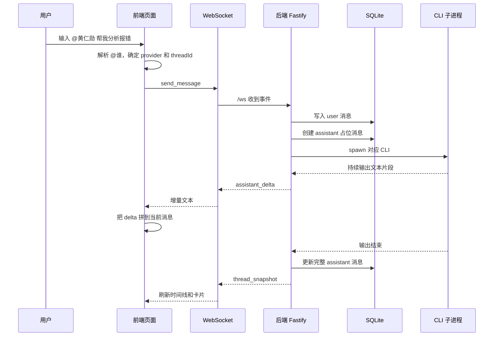
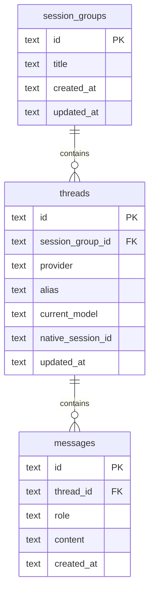

# Multi-Agent 架构文档

## 目录

1. [项目目标](#1-项目目标)
2. [整体结构](#2-整体结构)
3. [目录结构](#3-目录结构)
4. [技术栈与选型](#4-技术栈与选型)
5. [核心业务概念](#5-核心业务概念)
6. [前后端如何通信](#6-前后端如何通信)
7. [一条消息的完整链路](#7-一条消息的完整链路)
8. [前端分层说明](#8-前端分层说明)
9. [后端分层说明](#9-后端分层说明)
10. [数据库设计](#10-数据库设计)
11. [模型来源与同步](#11-模型来源与同步)
12. [重构前后对比](#12-重构前后对比)
13. [启动与运行方式](#13-启动与运行方式)
14. [后续演进方向](#14-后续演进方向)

---

## 1. 项目目标

`Multi-Agent` 是一个本地多模型聊天控制台。它把三套本地 CLI 放到同一个网页里统一管理：

- Codex
- Claude Code
- Gemini

用户在页面里发消息时，可以通过 `@范德彪`、`@黄仁勋`、`@桂芬` 来指定由哪一家回复。

这个项目的核心目标不是“做一个聊天页面”这么简单，而是：

- 把三套 CLI 的调用方式统一起来
- 把历史会话保存下来
- 让页面能实时显示回复
- 为后续继续扩展模型、额度、协作能力预留结构

一句话总结：

**这是一个“网页前端 + 本地后端 + 本地 CLI + 本地数据库”的多代理控制台。**

---

## 2. 整体结构

你可以把整套系统理解成 4 层：

1. 前端页面层  
   负责展示界面、接收用户输入、显示聊天记录和状态。

2. 后端服务层  
   负责暴露 HTTP / WebSocket 接口，组织业务逻辑，协调前端和 CLI。

3. CLI 调度层  
   负责真正启动 Codex / Claude / Gemini 命令，并解析它们的输出。

4. 存储层  
   负责把会话组、会话、消息保存到 SQLite。

技术上可以理解为：

- 前端负责“展示和交互”
- 后端负责“协议和协调”
- CLI 负责“生成回答”
- SQLite 负责“持久化”

---

## 3. 目录结构

```text
Multi-Agent/
├── app/                  # Next.js 页面入口
├── components/           # React 组件、stores、WebSocket 客户端
├── packages/
│   ├── api/              # Fastify 后端、WebSocket、SQLite、CLI orchestrator
│   └── shared/           # 前后端共享类型、常量、协议
├── multi-agent-skills/   # 预留的技能目录
├── data/                 # SQLite 数据文件
├── docs/                 # 补充文档
├── start-project.bat     # 后台启动脚本
├── stop-project.bat      # 后台停止脚本
└── ARCHITECTURE.md       # 当前文档
```

---

## 4. 技术栈与选型

### 4.1 前端

- Next.js 16
- React 19
- TypeScript
- Tailwind CSS
- Zustand
- 原生 WebSocket

### 4.2 后端

- Node.js
- Fastify
- `@fastify/websocket`
- TypeScript

### 4.3 存储

- SQLite

### 4.4 预留扩展

- Redis 预留位
- MCP / skills 预留位

### 4.5 为什么这样选

前端选 Next.js + React + TypeScript，是因为当前页面已经不是简单静态页，而是有：

- 左侧历史会话
- 顶部 3 个角色卡片
- 右侧聊天时间线
- 底部输入框
- 模型切换、停止、实时状态

这类页面继续堆原生 JS，会越来越难维护。

后端选 Fastify + TypeScript，是因为后端已经承担：

- HTTP 接口
- WebSocket
- CLI 调度
- 会话管理
- SQLite 存储

这已经不是单文件脚本长期适合承载的复杂度。

SQLite 适合作为起步存储，因为：

- 单机可用
- 不需要额外装数据库服务
- 比 JSON 文件更适合结构化查询

Redis 现在先留位，是为了以后承载更适合内存型存储的能力，例如：

- 运行时状态
- 队列
- 缓存
- 配额状态

---

## 5. 核心业务概念

这一部分很重要，因为页面里很多东西看着像“聊天记录”，但在代码和数据库里其实分了三层。

### 5.1 会话组

“会话组”表示一次完整的三方对话。

可以把它理解成：

- 左侧历史列表里的一条记录
- 一个根容器
- 一次完整的三方讨论

一个会话组下面通常会有三条子会话：

- Codex 一条
- Claude 一条
- Gemini 一条

### 5.2 会话

“会话”表示单个 provider 自己的上下文容器。

例如：

- Codex 会话
- Claude 会话
- Gemini 会话

会话里会记录：

- 属于哪个 provider
- 当前模型是什么
- 原生 session id 是什么

### 5.3 消息

“消息”就是聊天里的单条内容。

主要有两种角色：

- `user`
- `assistant`

所以三层关系是：

- 会话组
- 会话
- 消息

如果用一句话概括：

**会话组管一整组三方对话，会话管单家上下文，消息管具体内容。**

---

## 6. 前后端如何通信

前后端通信分两类：

1. HTTP  
   用来拉初始化数据、切换会话、改模型、停止会话。

2. WebSocket  
   用来做实时聊天、流式回复、状态更新。

### 6.1 HTTP 在这里是干什么的

HTTP 属于“请求-响应”模式。

意思是：

- 前端发一次请求
- 后端回一次结果
- 这次通信结束

当前主要用在这些场景：

- 页面初始化：`GET /api/bootstrap`
- 获取 provider 信息：`GET /api/providers`
- 获取某个会话组：`GET /api/session-groups/:id`
- 新建会话组：`POST /api/session-groups`
- 更新模型：`POST /api/threads/:id/model`
- 停止运行：`POST /api/threads/:id/stop`

### 6.2 WebSocket 在这里是干什么的

WebSocket 属于“长连接事件通信”模式。

意思是：

- 页面打开后，前端和后端建立一条持续存在的连接
- 后面双方都可以沿着这条连接不断发送消息

它的作用不是让聊天“看起来更高级”，而是让这些实时场景更自然：

- 模型一边生成，一边推文本
- 用户中途点击停止
- 后端即时回推状态
- 会话快照随时刷新

### 6.3 为什么你用起来感觉和以前差不多

因为你现在最常见的动作仍然是：

- 发一句
- 回一句

在这种单轮使用场景里，HTTP 流式和 WebSocket 看起来都像“一问一答”。

真正的区别在底层：

- 旧思路：每次聊天都重新开一次通信
- WebSocket：先建立一条持续连接，后续事件都在这条连接里来回走

所以 WebSocket 的收益更多体现在：

- 停止
- 状态同步
- 快照刷新
- 后续复杂实时交互

---

## 7. 一条消息的完整链路

这一节是整套系统最关键的部分。

### 7.1 时序图



### 7.2 文字版解释

1. 用户在输入框里输入消息，例如：

```text
@黄仁勋 帮我分析这个报错
```

2. 前端先解析 `@谁`，确定这条消息要发给哪一家。

3. 前端通过 WebSocket 发出 `send_message` 事件。

4. 后端收到后，先把用户消息写进 SQLite。

5. 后端再创建一条空的 assistant 消息。

6. 后端启动对应 CLI 子进程。

7. CLI 一边输出，后端一边解析输出流。

8. 后端不断把 `assistant_delta` 推回前端。

9. 前端把这些 delta 拼到同一条 assistant 消息上。

10. CLI 结束后，后端再推一次 `thread_snapshot`，让前端拿到最终最新状态。

### 7.3 为什么要先建 assistant 占位消息

因为流式回复不是一次把整段话返回，而是一小段一小段回来。

如果不先创建一条空消息，前端拿到第一段文本时就不知道该把它拼到哪条消息上。

技术上，这一步的作用就是：

- 先创建容器
- 后续所有 delta 都追加进这个容器

---

## 8. 前端分层说明

前端不是一个大页面文件写到底，而是分层组织的。

### 8.1 页面入口层

- `app/page.tsx`

作用：

- 组织整个页面
- 初始化数据
- 建立 WebSocket 连接

### 8.2 组件层

主要组件包括：

- `HeroHeader`：顶部状态条
- `ProviderStrip`：顶部 3 个角色卡片
- `SessionSidebar`：左侧历史会话列表
- `TimelinePanel`：右侧聊天时间线
- `Composer`：底部输入框

作用：

- 负责“怎么显示”

### 8.3 状态层

使用 Zustand，主要包括：

- `chatStore`
- `threadStore`
- `settingsStore`

作用：

- 记住当前输入
- 记住当前会话组
- 记住当前 provider 状态
- 记住实时连接状态

### 8.4 通信层

- `components/ws/client.ts`

作用：

- 创建 WebSocket 客户端
- 监听 `open / close / error / message`
- 把事件交给前端状态层处理

---

## 9. 后端分层说明

后端也不是所有逻辑堆在一个地方，而是分成几层。

### 9.1 路由层

- `packages/api/src/server.ts`

作用：

- 定义 HTTP 路由
- 定义 WebSocket `/ws`
- 接收前端事件
- 返回 JSON 或推送事件

### 9.2 业务层

- `packages/api/src/services/session-service.ts`

作用：

- 把“会话组、会话、消息、模型”这些业务逻辑组织起来

### 9.3 数据层

- `packages/api/src/storage/repositories.ts`
- `packages/api/src/storage/sqlite.ts`

作用：

- 读写 SQLite
- 管理表结构
- 负责实际增删改查

### 9.4 CLI 调度层

- `packages/api/src/runtime/cli-orchestrator.ts`

作用：

- 启动 CLI
- 传入模型参数
- 解析输出流
- 统一不同 CLI 的输出格式

### 9.5 模型探测层

- `packages/api/src/runtime/provider-profiles.ts`

作用：

- 读取本机真实配置和历史
- 识别当前模型
- 给前端返回模型候选列表

---

## 10. 数据库设计

### 10.1 关系图



### 10.2 三张表分别存什么

`session_groups`：

- 一条记录表示一组三方对话
- 对应左侧历史列表里的一张卡片

`threads`：

- 一条记录表示单个 provider 的会话
- 一组下面通常有 3 条线程

`messages`：

- 一条记录表示单条聊天消息
- 属于某一条线程

### 10.3 为什么要拆三张表

因为业务天然就是三层关系：

- 一组三方对话
- 这组三方里的单家会话
- 单家会话里的具体消息

如果全塞进一张表里，会很难表达：

- 左侧历史
- 单家上下文
- 时间线消息

---

## 11. 模型来源与同步

这一节很重要，因为它决定了前端显示的模型，是否真的和你在 CLI 里 `/model` 看到的一致。

### 11.1 当前模型从哪里来

后端会优先读取你本机真实环境：

- Codex  
  读取 `~/.codex/config.toml` 和 `~/.codex/models_cache.json`

- Claude Code  
  读取 `~/.claude/projects/*.jsonl` 里的最近真实会话模型

- Gemini  
  读取 `~/.gemini/tmp/**/*.json` 里的最近真实聊天模型

### 11.2 为什么要这样做

因为前端如果只写死默认值，就很容易和本机 CLI 当前状态不一致。

例如你本机实际已经切到：

- `gpt-5.4`
- `claude-sonnet-4-6`
- `gemini-3-flash-preview`

但前端还显示旧默认值，那就会让你误以为网页正在用错误模型。

### 11.3 旧数据怎么处理

后端启动时还会做一件事：

- 如果 SQLite 里还保留着旧版写进去的错误默认模型
- 后端会把这些旧默认值纠正成当前探测到的真实模型

这样做的目标是：

- 新会话默认值正确
- 老会话里的明显错误默认值也能被修正

---

## 12. 重构前后对比

### 12.1 重构前

更像一个能跑起来的原型：

- 前端是原生页面
- 后端更接近脚本式服务
- 实时层是旧式流方案
- 数据更偏临时保存

优点：

- 起步快
- 文件少
- 好理解

缺点：

- 功能一复杂就容易散
- 状态更容易互相打架
- 后续扩展成本高

### 12.2 重构后

现在是更正式的工程结构：

- 前端组件化
- 后端分层
- WebSocket 实时通道
- SQLite 结构化存储
- 本机真实模型探测

优点：

- 结构更稳
- 更适合继续扩展
- 历史会话、模型、状态更容易保持一致

代价：

- 项目结构更复杂
- 启动链路更长
- 调试面更宽

### 12.3 对普通使用者最能感受到的变化

- 历史会话不再只是临时显示，而是有结构化保存
- 三个角色被统一到一个页面里
- 顶部角色卡片、左侧历史、右侧时间线之间的状态更一致
- 后台启动和停止更稳定

---

## 13. 启动与运行方式

### 13.1 最简单的用法

如果你不想手动敲命令，直接这样用：

1. 双击 `start-project.bat`
2. 打开 `http://localhost:3000`
3. 用完双击 `stop-project.bat`

### 13.2 这两个脚本做了什么

`start-project.bat`：

- 清理旧进程
- 清理 `.next` 锁文件
- 后台启动 API
- 后台启动前端
- 等待健康检查通过

`stop-project.bat`：

- 清理 `3000`、`3001`、`8787`
- 按 PID 停掉后台进程
- 清理 `.next` 锁文件

---

## 14. 后续演进方向

这套架构已经比旧版稳定很多，但还可以继续升级：

- 把额度面板完整迁回新前端
- 增加历史会话搜索和筛选
- 给 SQLite 补迁移机制
- 真正接入 Redis
- 引入 MCP
- 优化模型列表自动发现
- 增强错误提示和自动重连

---

## 总结

如果只记一句话，请记这个：

**你在浏览器里发消息，前端通过 HTTP 和 WebSocket 跟本地后端通信；后端把消息写进 SQLite，再调起本地 CLI，把结果一段段推回页面。**

再简化一点就是：

**页面负责显示，后端负责协调，CLI 负责回答，数据库负责记住。**
