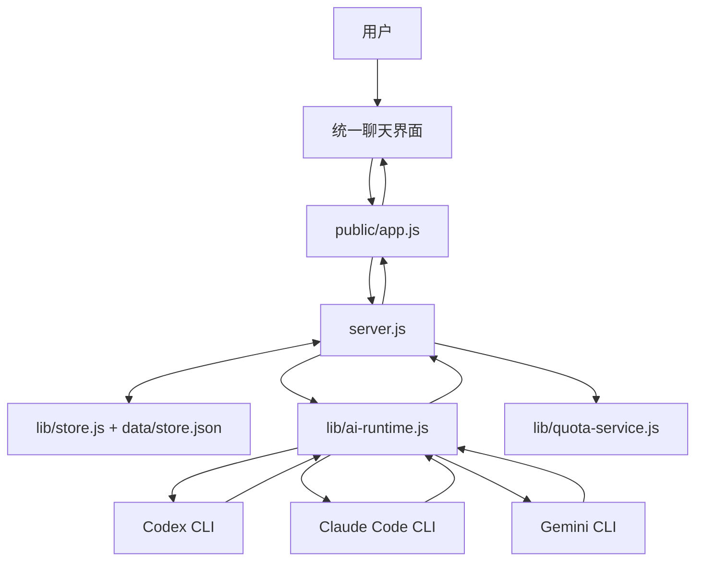

# 项目架构说明

这份文档按“小白也能看懂”的方式写，并且和当前项目的真实结构保持一致。

当前项目的核心目标不是做“三个并排聊天框”，而是：

**用一个网页，统一调度 3 个本地 CLI，会话层保持独立，界面层保持统一。**

---

## 1. 现在的交互方式是什么

页面现在只有一个主聊天区。

你在输入框里通过 `@名字` 指定谁来回复：

- `@范德彪` -> Codex
- `@黄仁勋` -> Claude Code
- `@桂芬` -> Gemini

页面上显示的是这 3 位“角色”，但它们背后仍然是 3 个真实的 CLI：

- `范德彪` 对应 `codex`
- `黄仁勋` 对应 `claude`
- `桂芬` 对应 `gemini`

每位角色名字后面还会带上当前模型名，例如：

- `范德彪 · gpt-5.4`
- `黄仁勋 · claude-sonnet-4-6`
- `桂芬 · auto-gemini-3`

如果当前模型还没有拿到，就先显示“模型未知”。

---

## 2. 为什么页面上不再是三个会话框

你前面明确提出过一点：

**你要的是“前端 @谁 然后谁来回复”，而不是三个独立会话框。**

所以当前前端结构已经改成：

- 左边：角色面板
- 右边：一个统一聊天区

这意味着：

- 用户只看一个对话流
- 通过 `@名字` 决定发给谁
- 不再让用户在三个大聊天框里跳来跳去

但要注意：

**界面统一，不等于底层会话合并。**

底层仍然保留 3 套独立会话，这样才能继续支持：

- 各自的 `resume`
- 各自的原生 session id
- 各自的额度统计
- 各自的停止

所以这个项目现在是：

- 前端统一
- 后端分开

---

## 3. 整体结构图



---

## 4. 角色名字和模型名是怎么来的

### 角色名字

角色名字是项目里固定定义的映射：

- Codex -> `范德彪`
- Claude Code -> `黄仁勋`
- Gemini -> `桂芬`

这层映射定义在后端，而不是只写在前端里。

这样做的好处是：

- 前后端统一
- 文档统一
- 将来如果你想改名字，只需要改一处逻辑

### 当前模型名

模型名尽量从“真实运行信息”里拿，而不是纯前端写死。

当前实现分两种来源：

1. 优先从 CLI 运行事件里拿  
   例如 Claude 和 Gemini 在运行事件里会带模型名。

2. 如果事件里拿不到，就读本地配置  
   例如 Codex 会优先从 `~/.codex/config.toml` 的 `model` 字段取默认模型。

所以你在页面里看到的：

- `范德彪 · xxx`
- `黄仁勋 · xxx`
- `桂芬 · xxx`

这不是单纯写死的字符串，而是：

- 固定角色名
- 加上当前模型名

---

## 5. `@谁` 到底是怎么工作的

这是这版前端最核心的新逻辑。

### 用户视角

你输入：

```text
@黄仁勋 帮我分析这个报错
```

前端会识别：

- `@黄仁勋` 是目标角色
- `帮我分析这个报错` 是真正要发给模型的内容

然后只把这条消息发给 `claude` 那条底层会话。

### 前端做了什么

前端会做 4 件事：

1. 解析输入框内容里有没有 `@`
2. 把 `@名字` 映射成某个 provider
3. 去掉前缀，只把真正内容发送给后端
4. 在统一聊天流里把这条消息显示成“你 -> 某角色”

### 当前支持的识别方式

前端不只识别中文名字，也兼容 provider 名称本身：

- `@范德彪` 或 `@codex`
- `@黄仁勋` 或 `@claude`
- `@桂芬` 或 `@gemini`

这样做是为了：

- 中文交互更自然
- 兼容你后面可能想直接写英文 provider 名

---

## 6. 为什么底层还是三个独立会话

虽然前端现在是一个统一聊天区，但底层仍然是：

- 一条 Codex 会话
- 一条 Claude 会话
- 一条 Gemini 会话

原因很简单：

如果把三家真的合成一条底层会话，就会丢掉很多关键能力：

- 没法继续各自原生 `resume`
- 没法保存各自的 session id
- 没法分别停止
- 没法分别统计额度

所以当前正确的理解是：

- 界面层：一个聊天区
- 会话层：三条独立会话
- 路由层：靠 `@名字` 决定发给哪一条会话

---

## 7. 一条消息从输入到回复的完整流程

下面用：

```text
@桂芬 帮我总结这个项目结构
```

作为例子。

### 第 1 步：前端监听提交

前端监听输入框表单提交。

作用：

- 拿到用户输入
- 进入 `@` 解析逻辑

### 第 2 步：前端解析 `@`

前端发现：

- `@桂芬` -> `gemini`
- 剩余正文 -> `帮我总结这个项目结构`

### 第 3 步：前端只发给对应 provider

前端不会再像早期版本那样默认分发到三个大聊天框里。

而是只调用：

- 对应 `gemini` 的那条底层会话

### 第 4 步：后端把消息写进对应会话

后端收到请求后，会把这条消息写进 Gemini 对应的会话记录。

### 第 5 步：后端启动对应 CLI

后端进入 `lib/ai-runtime.js`，启动 Gemini CLI 子进程。

### 第 6 步：流式返回回复

CLI 一边生成，后端一边把文本流回前端。

### 第 7 步：前端把回复追加到统一聊天区

前端不会开新的独立聊天框，而是把这条回复插到统一聊天流里，并显示成：

- `桂芬 · 当前模型`

---

## 8. 前端现在监听了什么

### 1. 输入框提交

作用：

- 解析 `@谁`
- 把消息发给指定角色

### 2. 输入框回车

作用：

- `Enter` 发送
- `Shift+Enter` 换行

### 3. 角色面板里的 `@ta`

每个角色卡片上都有一个 `@ta` 按钮。

作用：

- 自动往输入框插入 `@范德彪` / `@黄仁勋` / `@桂芬`

### 4. 角色面板里的停止按钮

作用：

- 停止对应角色当前正在运行的那次 CLI

### 5. 主聊天流的流式读取

前端继续通过 `fetch + reader` 读取流式返回。

作用：

- 边生成边显示
- 回复完成后更新模型状态与额度状态

### 6. 定时刷新

前端会定时刷新：

- provider 身份信息
- 额度信息

作用：

- 保持角色名后的模型名是最新的
- 保持角色卡片里的额度摘要最新

---

## 9. 现在前端为什么更符合你的需求

你这次的关键诉求有两点：

1. 不是三个会话框  
2. 可以 `@谁` 然后谁回复

现在这两点都已经落实成结构级变化，而不是小修小补：

- 页面布局已经从“三列聊天框”改成“一个主聊天区 + 角色面板”
- 发送逻辑已经从“多框分别发”改成“输入中解析 @ 路由”

所以当前页面的核心交互已经不是：

- “去哪个框说话”

而是：

- “在一个统一输入框里 @ 对应角色”

---

## 10. 当前技术选型为什么还合理

虽然交互升级了，但底层技术栈仍然没变：

- 前端：原生 HTML/CSS/JS
- 后端：Node 原生 `http`
- CLI 调度：`child_process.spawn`
- 存储：JSON 文件

这仍然合理，因为：

- 当前最复杂的是交互逻辑，不是组件数量
- 原生前端仍然足够承载这一版
- 本地单机工具的核心瓶颈不在前端框架

但后面如果继续做复杂化，前端会越来越适合升级到：

- React / Vue

尤其是当你以后想做这些功能时：

- 多会话切换
- 会话分组
- 多角色同时引用
- 更复杂的输入提示和自动补全

---

## 11. 关键文件职责

### [public/index.html](C:\Users\-\Desktop\Multi-Agent\public\index.html)

职责：

- 定义统一聊天页结构
- 定义角色卡片模板
- 定义统一消息模板

### [public/app.js](C:\Users\-\Desktop\Multi-Agent\public\app.js)

职责：

- 解析 `@名字`
- 路由消息到指定 provider
- 合并三条底层会话为一个聊天流
- 渲染角色卡片
- 渲染统一聊天区

### [public/styles.css](C:\Users\-\Desktop\Multi-Agent\public\styles.css)

职责：

- 把页面做成“左侧角色、右侧主聊天”的布局
- 不再保留三个大聊天框的视觉结构

### [lib/ai-runtime.js](C:\Users\-\Desktop\Multi-Agent\lib\ai-runtime.js)

职责：

- 统一拉起三家 CLI
- 维护角色名映射
- 尽量解析当前模型名
- 把模型信息回传给后端

### [server.js](C:\Users\-\Desktop\Multi-Agent\server.js)

职责：

- 新建会话时附带模型占位信息
- 运行结束后把当前模型写回对应会话
- 给前端下发 provider 身份信息

---

## 12. 目前还没完全解决的点

### 1. 真实剩余额度

页面已经有“额度区”这套前端结构，但三家真正网页里的“剩余额度”接口还没有完全打通。

当前状态是：

- 前端结构已经准备好
- 文案也已经改成额度语义
- 但真实剩余额度仍然受各家网页登录态和反机器人机制限制

### 2. 第一次启动时的模型名

Claude 和 Gemini 一般能在实际运行事件里拿到模型名。  
Codex 则更多依赖本地配置读取。

所以第一次进入页面时：

- 有些模型名可能能直接看到
- 有些可能要等第一轮真实运行后才会变成最终值

---

## 13. 后续建议

下一步最值得做的两件事是：

1. 把真实剩余额度打通  
2. 给输入框加 `@名字` 自动补全

如果继续往前做，这个项目会越来越像：

- 一个统一的多代理本地协作台

而不是：

- 三个 CLI 的简单网页包装
---

## 14. 最近一次界面调整：把左侧彻底改成“联系人列表”

这次改动的原因很直接：

- 虽然上一版已经从“三列聊天框”改成了“左侧角色 + 右侧主聊天”
- 但左侧视觉上还是太像 3 个小面板
- 用户看过去，仍然容易理解成“其实还是 3 个独立会话框”

所以这次继续收敛了左侧的职责和样式。

### 现在左侧是什么

现在左侧不是“会话框”，而是“联系人列表”。

每个联系人条目只做这几件事：

- 显示角色昵称
- 显示当前模型
- 显示最近一条消息摘要
- 显示当前状态
- 提供 `@ta / 停止 / 新建` 三个快捷动作

也就是说，左侧只是告诉你“有哪些角色可以聊”，不再承担完整聊天记录展示。

### 真正的聊天记录在哪里

真正的聊天记录只在右侧主时间线里。

这很重要，因为它决定了用户的心智模型：

- 左侧 = 联系人区
- 右侧 = 聊天区
- 底部 = 唯一输入口

所以你不是在操作 3 个页面，而是在一个页面里和 3 个角色聊天。

### 为什么这样更适合 `@谁`

因为这个项目的核心交互不是“点击某个窗口输入”，而是：

1. 在唯一输入框里输入内容
2. 用 `@谁` 指定目标角色
3. 让对应角色回复

如果左侧继续长得像 3 个迷你会话框，用户就会天然以为：

- 应该去每个框里分别输入
- 每个框各自维护自己的输入逻辑

这会和 `@谁` 的交互方式冲突。

把左侧改成联系人列表之后，整个交互就统一了：

- 你只在底部输入
- 你只看右侧主时间线
- 你只通过 `@谁` 来切换目标角色

### 前端这次具体怎么承载这个变化

这次前端主要改了两层：

1. 结构层

- `public/index.html` 里的角色模板改成了联系人条目结构
- 增加了头像块、标题行、摘要行
- 不再把左侧角色区域写成迷你聊天面板

2. 样式层

- `public/styles.css` 里把左侧做成更像通讯录/群成员列表
- 条目更紧凑
- 头像、昵称、状态、模型、摘要的信息层级更明确
- 用户扫一眼就能知道该 `@谁`

### 这次改动后的直接效果

现在页面的语义更清楚了：

- 左侧是联系人
- 右侧是聊天记录
- 底部是统一输入

这和项目目标是对齐的：不是保留 3 个会话框，而是做成一个统一页面，通过 `@谁` 控制谁来回复。

---

## 15. 左侧卡片现在可以直接切换模型

这次又补了一层能力：  
现在每个角色联系人卡片里，都可以直接设置这个角色当前会话要调用的模型。

### 为什么要把模型选择放在卡片里

因为你的使用方式不是只想看“当前识别出来的模型”，而是想主动指定：

- Codex 这次用哪个模型
- Claude Code 这次用哪个模型
- Gemini 这次用哪个模型

如果模型选择不放在角色卡片里，你就得：

- 先记住每家 CLI 怎么切模型
- 再去命令行改
- 然后再回网页发消息

这对前端来说不完整。

所以现在的做法是：

- 角色卡片里直接有一个模型输入框
- 你填好模型名后点击“保存模型”
- 后端把这个模型保存到当前会话
- 下一次你再 `@谁` 发消息时，后端就按这个模型去调用 CLI

### 这一层是怎么工作的

流程是：

1. 你在左侧某个角色卡片里输入模型名
2. 前端调用 `POST /api/threads/:id/model`
3. 后端把当前会话的 `currentModel` 更新掉
4. 前端立刻把“当前模型”文案刷新掉
5. 之后该角色再发送消息时，后端会把这个模型参数带给对应 CLI

### 三家 CLI 现在怎么带模型参数

这部分我不是按记忆写的，而是按本机 CLI 帮助和官方参数形态接的：

- Codex CLI：`--model` / `-m`
- Claude Code CLI：`--model`
- Gemini CLI：`--model` / `-m`

所以当前后端会这样做：

- Codex：在命令里加 `-m <model>`
- Claude Code：在命令里加 `--model <model>`
- Gemini：在命令里加 `--model <model>`

### 为什么卡片里是“输入模型名”，不是死板下拉框

因为模型名称会变，尤其是这些 CLI 会随着版本更新不断新增或调整模型。

如果我把它做成一个完全写死的下拉框，会有两个问题：

- 新模型出来后，前端列表就立刻过时
- 你如果有特殊模型名，前端根本选不到

所以当前做法是：

- 提供一个可输入的模型框
- 同时提供一个可搜索下拉候选列表
- 再给出少量常见建议值

这样你既能快速选，也不会被前端写死的列表限制住。

也就是说，它不是死板的 `select`，而是更像“可搜索的组合框”：

- 你可以直接点候选
- 也可以自己输入自定义模型名
- 也可以点击“刷新模型”重新拉一次本机候选

### 这些候选模型现在从哪里来

现在前端不再主要依赖写死的模型列表，而是优先使用后端返回的动态候选。

后端来源分三类：

1. Codex  
   读取本机 `~/.codex/models_cache.json`，这份缓存里有真实模型列表，所以 Codex 的候选最接近本机实际可选项。

2. Claude Code  
   读取本机 `~/.claude/settings.json`，再结合本地 changelog 和常见官方别名做候选补充。

3. Gemini  
   读取本机 `~/.gemini/settings.json`，再从本地历史会话里抽取已经出现过的模型名，最后和常见模型名合并。

这套逻辑的目的不是“保证 100% 全量”，而是做到两点：

- 候选尽量贴近你这台机器真实用过或真实可见的模型
- 就算候选里没有，你仍然可以自己手输模型名

### 保存后前端怎么显示

保存后，左侧卡片的“当前模型”会直接更新。  
同时，新建这个角色的新会话时，也会继承你当前卡片已经保存的模型，不会新开一次就丢掉。

### 这和自动识别模型有什么关系

这个项目里现在同时存在两种模型来源：

1. 你手动选择的模型  
   这是“你希望调用哪个模型”

2. CLI 运行时实际回传的模型  
   这是“CLI 实际用了哪个模型”

在理想情况下，这两者会一致。  
如果 CLI 最终回传了更精确的模型名，前端会继续以更精确的结果为准更新显示。
---

## 16. 前后端选型原因、优势、缺点和后续改进

这一节专门回答一个很实际的问题：

- 前端为什么这样选
- 后端为什么这样选
- 这样选有什么好处
- 这样选有什么不足
- 后面如果项目继续变大，应该往哪里升级

这部分和“功能怎么用”不是一回事。  
它讲的是“为什么这个项目现在会长成这样”。

### 16.1 前端为什么选原生 HTML / CSS / JS

当前前端没有上 React、Vue、Next.js 这类框架，而是直接用：

- HTML 负责结构
- CSS 负责样式
- 原生 JavaScript 负责交互和请求

这么选的原因主要有 4 个：

1. 这个项目一开始的目标不是做一个大型网站  
   它最初是一个“把 3 个本地 CLI 聚合到一个页面里”的本地工具。

2. 这个项目最核心的复杂度不在前端框架  
   真正复杂的是：
   - 本地 CLI 调起
   - 会话保存
   - 流式输出
   - 不同 provider 的参数兼容

3. 原生前端起步更快  
   不需要先搭脚手架、构建链、状态管理、组件体系，就能先把功能跑通。

4. 你当前项目是本地单机工具，不是多人协作的大型 Web 产品  
   在这个阶段，少一层框架，反而更容易直接控制行为。

### 16.2 前端这样选的优势

优点主要有这些：

- 依赖少  
  项目启动简单，不需要先装一堆前端依赖。

- 可读性直接  
  `public/index.html`、`public/styles.css`、`public/app.js` 三个文件就能看清主要页面逻辑。

- 调试成本低  
  出问题时，不需要先判断是框架生命周期、状态库、路由还是构建工具的问题。

- 很适合当前这种“本地工具型页面”  
  页面重点是把本地能力接出来，而不是做复杂的站点级导航。

### 16.3 前端这样选的缺点

缺点也很明显：

- 代码会越来越散  
  交互越多，原生 JS 越容易把状态、事件、渲染逻辑混在一起。

- 组件复用能力弱  
  比如角色卡片、模型选择器、消息气泡这些，原生写法复用性不如组件框架自然。

- 状态管理会逐渐变难  
  现在还只是 3 个角色、若干接口、几个状态字段。后面如果再加权限、设置、更多页面，会越来越难维护。

- UI 复杂度一上来就容易脆  
  比如现在已经有：
  - 统一聊天流
  - `@谁` 路由
  - 模型选择
  - 模型候选刷新
  - 流式回复
  这些都堆在原生脚本里，后面继续加功能会更吃力。

### 16.4 前端后续怎么改进

如果这个项目继续变大，前端建议这样升级：

1. 先做轻量组件化  
   即使不马上上 React，也可以先把角色卡片、消息项、模型选择器的渲染逻辑拆干净。

2. 再考虑升级到 React / Vue  
   当你出现下面这些需求时，就很值得升：
   - 多页面
   - 设置页
   - 用户配置管理
   - 更复杂的局部状态同步
   - 更频繁的 UI 迭代

3. 把状态分层  
   把“会话状态”“运行状态”“额度状态”“模型候选状态”拆开，不要继续全堆在一个大脚本对象里。

4. 把实时流渲染做成独立模块  
   这样后面如果要切 WebSocket 或 SSE，不至于把页面逻辑一起打散。

### 16.5 后端为什么选 Node 原生 `http`

当前后端没有用 Express、Koa、Nest 这类框架，而是直接用 Node 原生 `http` 模块。

这么选的原因主要有 5 个：

1. 这个后端职责很明确  
   它主要做的是：
   - 提供几个 JSON API
   - 提供一个流式消息接口
   - 调本地 CLI 子进程
   - 保存会话数据

2. 接口数量不多  
   当前 API 其实很有限：
   - `/api/health`
   - `/api/providers`
   - `/api/quotas`
   - `/api/threads`
   - `/api/threads/:id`
   - `/api/threads/:id/messages`
   - `/api/threads/:id/stop`
   - `/api/threads/:id/model`

3. 这个项目对“流式返回”要求很强  
   原生 `http` 直接写流，控制最直接，不需要先绕一层框架抽象。

4. 这个项目本质上是“本地 CLI 调度器”  
   后端最重要的不是 Web 框架能力，而是：
   - `child_process.spawn`
   - 事件流处理
   - 本地文件存储

5. 保持依赖少  
   对本地工具来说，依赖越少，环境问题越少。

### 16.6 后端这样选的优势

优点主要有：

- 控制力强  
  流式响应、进程管理、请求返回都很直接。

- 依赖少  
  不需要额外引入 Web 框架就能跑。

- 很适合本地工具  
  当前服务不是高并发公网服务，而是给本机页面提供能力。

- 易于贴近底层行为  
  尤其是你现在这个项目，最核心的是和本地 CLI 打交道，原生后端更方便贴着系统层实现。

### 16.7 后端这样选的缺点

缺点也很明确：

- 路由和中间件能力都要自己写  
  现在接口还不多，问题不大；一多就会开始显得原始。

- 参数校验会越来越散  
  没有统一 schema 层时，请求校验容易分散在各个 handler 里。

- 错误处理容易不统一  
  原生 `http` 写久了，很容易每个接口各写各的。

- 可扩展性一般  
  后面如果要加鉴权、配置中心、插件式 provider、更多 API，自己维护成本会上升。

### 16.8 后端后续怎么改进

如果后端继续扩展，建议按这个顺序升级：

1. 先抽路由层  
   把每类接口拆成独立模块，不要全部继续堆在 `server.js`。

2. 增加统一请求校验  
   可以引入 `zod` 或 `ajv` 这类 schema 校验层，让请求体和响应结构更稳定。

3. 再考虑换 Express / Fastify  
   如果接口数量继续增长，`Fastify` 会比继续手写原生 `http` 更省维护成本。

4. 把 provider 调度抽成插件结构  
   现在是 3 家 CLI。后面如果再加第 4、第 5 家，最好变成统一 provider 插件接口。

### 16.9 为什么存储先选 JSON 文件

当前会话和额度观测数据保存在本地 JSON 文件里。

原因很简单：

- 本地工具优先跑通
- 不需要额外安装数据库
- 数据量目前不大
- 用户可以直接看到和备份本地数据

优点：

- 简单
- 透明
- 好迁移

缺点：

- 并发写入能力弱
- 数据量大了性能会变差
- 不适合复杂查询

后续改进：

- 如果会话越来越多，建议升级到 SQLite

### 16.10 为什么通信先选 HTTP + 流式 NDJSON

当前前后端通信不是 WebSocket，而是：

- 普通接口走 JSON
- 发消息走 HTTP 流
- 流里的数据格式是一行一个 JSON，也就是 NDJSON

为什么这样选：

1. 实现简单  
   浏览器原生 `fetch` 就能处理。

2. 足够满足当前需求  
   你现在最关键的是“发消息后持续看到回复”，NDJSON 已经够用。

3. 后端实现直接  
   `response.write()` 就能持续往外推事件。

优点：

- 简单
- 好调试
- 兼容性强

缺点：

- 不如 WebSocket 灵活
- 双向实时控制能力弱一些
- 事件类型越来越多后，需要自己维护协议约定

后续改进：

- 如果后面要做更复杂的实时协作，可升级为 WebSocket
- 如果仍然是单向服务端推流，也可以考虑 SSE

### 16.11 当前这套选型为什么仍然成立

一句话总结：

这套技术选型不是“最豪华”的，但它对当前项目阶段是合理的。

因为你现在最重要的目标不是先做成一个大而全的平台，而是：

- 把 3 家 CLI 聚合起来
- 把会话跑通
- 把 `@谁` 路由跑通
- 把模型选择跑通
- 把流式回复跑通

在这个阶段：

- 原生前端够用
- 原生 Node 后端够用
- JSON 存储够用
- HTTP + NDJSON 够用

等你把功能继续做大，再逐层升级，成本最低，也最稳。

## 16. 前后端选型原因、优势、缺点和后续改进

这一节专门回答一个很实际的问题：

- 前端为什么这样选
- 后端为什么这样选
- 这样选有什么好处
- 这样选有什么不足
- 后面如果项目继续变大，应该往哪里升级

它讲的不是“这个项目能做什么”，而是“为什么这个项目现在会长成这样”。

### 16.1 前端为什么选原生 HTML / CSS / JS

当前前端没有上 React、Vue、Next.js 这类框架，而是直接用：

- HTML 负责结构
- CSS 负责样式
- 原生 JavaScript 负责交互和请求

这样选，主要是因为：

1. 这个项目一开始是本地工具，不是大型网站  
   它最初的目标是把 3 个本地 CLI 聚合到一个页面里用，而不是先做一套复杂前端工程体系。

2. 当前最核心的复杂度不在前端框架  
   这个项目真正难的地方是：
   - 调本地 CLI
   - 处理流式输出
   - 保存会话
   - 兼容三家不同参数
   - 支持 `@谁` 路由到不同角色

3. 原生前端起步更快  
   不需要先搭构建链、状态管理、组件库、打包流程，就能先把功能做出来。

4. 本地单机项目，少一层框架反而更直接  
   你现在更关心“功能先跑通”，不是“前端工程体系先做满”。

### 16.2 前端这样选的优势

- 依赖少  
  项目启动简单，不需要先装一大堆前端依赖。

- 结构直观  
  主要页面逻辑集中在 `public/index.html`、`public/styles.css`、`public/app.js`，阅读门槛低。

- 调试成本低  
  页面和接口是一一对应的，出现问题时更容易快速定位。

- 很适合现在这个阶段  
  当前页面虽然已经有统一聊天区、联系人侧栏、模型选择、额度面板，但整体还属于“本地工具型界面”，不是复杂产品门户。

### 16.3 前端这样选的缺点

- 代码会越来越散  
  功能一多，原生 JS 很容易把状态、渲染、事件处理混在一起。

- 复用能力一般  
  联系人条目、消息项、模型选择器、额度块这些区域，如果继续变复杂，用组件化方式会更好维护。

- 状态管理会越来越吃力  
  现在前端要维护：
  - 会话列表
  - 当前聊天流
  - 当前选中模型
  - 运行状态
  - 额度显示
  - 动态候选模型

  这些都继续堆在原生脚本里，后面会越来越重。

- 大规模交互升级时不够舒服  
  如果后面加多标签、多窗口、拖拽布局、更多实时协作，原生方式会变得吃力。

### 16.4 前端后续怎么改进

如果这个项目继续变大，前端建议按这个顺序升级：

1. 先做轻量组件化  
   即使不上 React，也可以先把联系人卡片、消息项、模型选择器、额度面板拆成清晰的渲染函数。

2. 把状态管理收口  
   把“provider 状态”“聊天状态”“模型状态”“额度状态”分层管理，不要继续全堆在一个大脚本里。

3. 再决定是否升级到 React / Vue  
   当界面复杂到原生方式明显拖慢开发时，再上框架最划算。

4. 通信层与界面层解耦  
   把 NDJSON 流读取、接口调用、错误处理封成独立模块，这样以后切 WebSocket 或 SSE 更稳。

### 16.5 后端为什么选 Node 原生 `http`

当前后端没有用 Express、Koa、Nest 这类框架，而是直接用 Node 原生 `http` 模块。

主要原因是：

1. 后端职责很明确  
   它主要做的就是：
   - 提供 JSON API
   - 提供流式消息接口
   - 调本地 CLI 子进程
   - 保存会话和状态

2. API 数量不算多  
   当前接口虽然有 `/api/providers`、`/api/threads`、`/api/threads/:id/messages`、`/api/threads/:id/model`、`/api/quotas` 这些，但整体仍然是一个小型本地服务。

3. 流式输出用原生 `http` 很直接  
   `response.write()` 就能持续往前端推送 NDJSON 事件，不需要额外封装太多层。

4. 这个项目本质上是“本地 CLI 调度器”  
   后端最重要的不是 Web 框架生态，而是：
   - `child_process.spawn`
   - 流式读取 stdout / stderr
   - 终止子进程
   - 记录运行状态

5. 依赖越少，环境越稳  
   对本地工具来说，少依赖通常意味着更少安装问题和兼容问题。

### 16.6 后端这样选的优势

- 控制力强  
  请求怎么进、流怎么写、进程怎么停，都是直接控制。

- 离系统层更近  
  这个项目核心就是和本地 CLI 打交道，原生后端更方便贴近底层实现。

- 流式处理简单直接  
  当前 HTTP + NDJSON 方案非常适合“模型一边生成、前端一边显示”的场景。

- 适合本地单机场景  
  不需要为了一个本地服务先把完整 Web 框架体系搭起来。

### 16.7 后端这样选的缺点

- 路由和工具能力都要自己写  
  没有成熟框架帮你处理很多通用问题。

- `server.js` 容易越长越重  
  如果继续加接口、加 provider、加权限逻辑，后面会越来越难维护。

- 协议和错误处理要自己约束  
  比如流式事件格式、错误响应结构、停止逻辑、模型更新逻辑，都要自己保持一致。

- 扩展到更复杂系统时会显得原始  
  如果后面要加用户体系、配置中心、插件系统、多实例部署，原生 `http` 会开始显得吃力。

### 16.8 后端后续怎么改进

建议按这个顺序升级：

1. 先把路由拆模块  
   不要让所有 API 都继续堆在 `server.js` 里。

2. 把 provider 调度层继续抽象  
   让 Codex、Claude、Gemini 的启动、停止、模型参数、会话恢复都有统一接口。

3. 给接口加统一校验  
   比如对输入参数做 schema 校验，避免前后端约定越来越松。

4. 如果 API 继续变多，再考虑 Express / Fastify  
   不是现在必须上，而是当“维护成本明显变高”时再上。

### 16.9 为什么存储先选 JSON

当前会话、消息、状态主要存在本地 JSON 文件里。

这样选的原因也很现实：

- 简单
- 直接
- 无需安装数据库
- 很适合本地单机原型

优点：

- 易看
- 易改
- 易备份

缺点：

- 并发能力弱
- 查询能力弱
- 数据量大了后不适合继续撑

后续改进：

- 当会话越来越多时，建议升级到 SQLite

### 16.10 为什么通信先选 HTTP + 流式 NDJSON

当前前后端通信不是 WebSocket，而是：

- 普通接口走 JSON
- 发消息走 HTTP 流
- 流里的格式是一行一个 JSON，也就是 NDJSON

这样选是因为：

1. 浏览器原生支持，接入成本低  
   用 `fetch` 就能拿到流式响应。

2. 非常适合当前场景  
   你最核心的需求是“发消息后持续看到模型回字”，NDJSON 已经够用。

3. 后端实现直接  
   用 `response.write()` 就可以持续推送事件。

优点：

- 简单
- 稳
- 容易调试

缺点：

- 双向实时能力不如 WebSocket
- 事件类型越来越多后，需要自己维护协议

后续改进：

- 如果以后要做更复杂实时协作，可以升级为 WebSocket
- 如果仍然只是单向推流，也可以考虑 SSE

### 16.11 当前这套选型为什么仍然成立

一句话总结：

这套技术选型不是“最豪华”的，但它对当前项目阶段是合理的。

因为你现在最重要的目标不是先做一个大型平台，而是：

- 把 3 家 CLI 聚合起来
- 让页面能聊天
- 支持 `@谁` 指定回复
- 支持保存会话
- 支持模型选择
- 支持流式显示

在这个阶段：

- 原生前端够用
- 原生 Node 后端够用
- JSON 存储够用
- HTTP + NDJSON 够用

等功能继续变大，再逐层升级，成本最低，也最稳。

## 17. 这次界面结构为什么改成“顶部角色卡片 + 左侧历史会话”

你这次提出的核心问题不是“页面好不好看”，而是两个更实际的问题：

1. 角色卡片放在左边会占掉太多纵向空间  
2. 你一新建会话，旧的三方聊天历史在页面里没有入口回去看

所以这一版结构改成了：

- 顶部：3 个角色卡片
- 左侧：历史会话列表
- 右侧：当前选中的统一聊天区

### 17.1 为什么角色卡片改到顶部

角色卡片的职责其实很固定，只负责：

- 显示这个角色是谁
- 显示当前模型
- 显示额度摘要
- 提供 `@ta`、停止、模型切换这些工具

它本质上是“工具条”，不是“聊天历史本体”。

既然它只是工具条，就不应该长期占用左侧最宝贵的列表空间。  
所以现在把它移到顶部，让左侧留给更重要的东西：历史会话。

### 17.2 为什么左侧改成历史会话，而不是继续放 3 张角色卡片

因为你真正要保留的是：

- 第 1 次三方对话
- 第 2 次三方对话
- 第 3 次三方对话

也就是“每一次完整的三方会话记录”。

如果左侧继续只是 3 个固定角色，那它只能表示：

- Codex
- Claude
- Gemini

却不能表示：

- 这周一你和三家聊过的一次需求
- 昨天你又开的一次新任务
- 刚才新开的测试会话

所以左侧现在显示的是“会话组列表”，不是“角色列表”。

### 17.3 什么是“会话组”

这一版后端新增了一个更贴近业务的概念：会话组。

你可以把它理解成：

- 一次完整的三方对话容器

一个会话组里会绑定 3 条底层会话：

- 1 条 Codex 会话
- 1 条 Claude 会话
- 1 条 Gemini 会话

这样做之后，页面就能明确区分：

- 顶部角色卡片：当前这组会话里的三个角色工具面板
- 左侧历史列表：所有三方会话组
- 右侧聊天区：当前选中会话组的统一消息流

### 17.4 这次前端怎么工作

当前页面交互变成这样：

1. 进入页面后，前端先请求会话组列表
2. 左侧把所有三方会话组渲染出来
3. 默认打开最近更新的一组
4. 右侧只显示这一组里的统一聊天记录
5. 顶部 3 张卡片只操作这一组里的 3 条底层会话

也就是说：

- 你切换左侧历史
- 顶部 3 张卡片会跟着切换到那一组
- 右侧聊天区也会跟着切换到那一组

### 17.5 这次后端怎么支持历史会话

后端新增了“会话组”存储和接口。

现在不只是保存单条 `thread`，还会保存：

- 一个 `sessionGroup`
- 这个 `sessionGroup` 里分别对应哪 3 条 thread

这样你新建一组新的三方会话时：

1. 后端先创建一个新的会话组
2. 再分别创建 Codex / Claude / Gemini 三条底层会话
3. 把这 3 条会话挂到这个会话组下面

之后左侧历史列表就能一直保留这组记录，不会因为你又新建一组而消失。

### 17.6 现在前后端新增了哪些接口能力

这次围绕历史会话组新增了这些能力：

- `GET /api/session-groups`
  用来获取左侧历史会话列表

- `POST /api/session-groups`
  用来新建一组新的三方会话

- `GET /api/session-groups/:id`
  用来加载某一组会话对应的 3 条底层会话详情

保留原有接口：

- `POST /api/threads`
- `POST /api/threads/:id/messages`
- `POST /api/threads/:id/model`
- `POST /api/threads/:id/stop`

所以现在是两层结构：

- 会话组层：决定“你当前在看哪一次三方对话”
- 底层会话层：决定“这一组里每个 CLI 各自的上下文和模型”

### 17.7 这次改完后，你能得到什么

改完后，页面行为会更符合你的真实使用习惯：

- 顶部一眼看到三位角色和当前模型
- 左侧一直能翻历史
- 右侧只专注当前这一次会话
- 新建一组会话不会把旧历史冲掉
- 你切换历史时，三位角色和统一聊天区会一起切换

### 17.8 这次具体改了哪些文件

为了实现这次结构调整，主要改了这些文件：

- `public/index.html`
  把页面骨架改成“顶部角色卡片 + 左侧历史会话 + 右侧聊天区”

- `public/styles.css`
  把页面布局和样式改成新的三段结构

- `public/app.js`
  增加会话组加载、左侧历史切换、当前会话组同步渲染

- `server.js`
  新增会话组相关接口

- `lib/store.js`
  新增会话组存储能力，并把一组三方会话关联起来

### 17.9 现在切换左侧历史时，前后端到底怎么配合

这部分用最简单的话说就是：

1. 你点击左侧某一条历史会话
2. 前端发 `GET /api/session-groups/:id`
3. 后端把这一组里的 3 条底层会话都返回给前端
4. 前端把：
   - 顶部 3 张角色卡片
   - 右侧统一聊天记录
   - 当前运行状态
   一起切换到这组数据

所以“切历史”不是只切一条标题，而是整组切换。

### 17.10 为什么这次文档里要强调“会话组”和“底层会话”两层

因为如果不把这两层分开，你会很容易再次遇到两个理解混乱：

1. 为什么页面只有一个聊天区，但底层还是三条会话  
2. 为什么左侧历史切换后，三位角色也会一起跟着变

现在分层之后就清楚了：

- 会话组层
  负责“这一次三方对话”的整体切换

- 底层会话层
  负责每个 CLI 自己的上下文、模型、恢复和停止

这样前端体验和后端实现就能同时成立。
