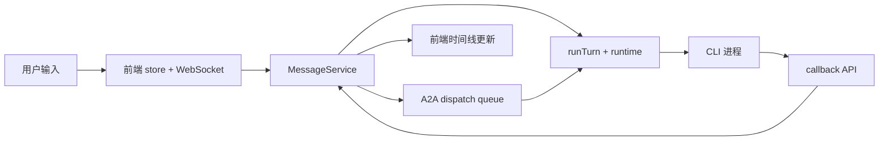
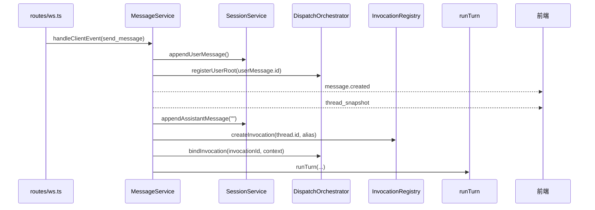
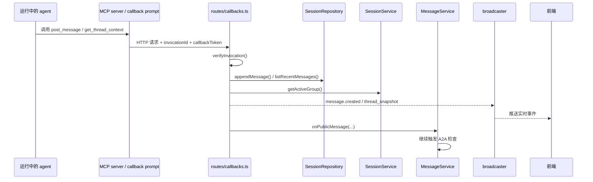

# A2A、MCP 与前后端调用详解

这份文档专门把三条链讲透：

1. 前端一条 `send_message` 怎么变成一次真实 CLI 运行。
2. 运行中的 agent 怎么通过 callback API / MCP 把消息再送回系统。
3. A2A 为什么能继续接力，以及它现在为什么是串行而不是全并发。

本文所有术语都对照当前代码，不做脱离实现的抽象说明。

---

## 1. 先看三条主链



你可以把系统里的实时链路理解成三段：

- 用户发起链：前端 -> 后端 -> CLI
- agent 回流链：CLI -> callback / MCP -> 后端
- agent 接力链：公开消息 -> mention 解析 -> A2A 队列 -> 下一跳 runtime

---

## 2. 前端先做了什么

### 2.1 用户输入不是直接发字符串

入口：

- `components/chat/composer.tsx`
- `components/stores/chat-store.ts`

用户提交输入后，前端会先走：

- `useChatStore().sendMessage(input)`

然后在 `thread-store.ts` 里调用：

- `buildSendPayload(input)`

### 2.2 `buildSendPayload()` 在代码里代表什么

它不是简单的“裁掉 `@` 前缀”，它做了四件事：

1. 解析 `@agent`
2. 把别名映射成内部 `provider`
3. 找到当前活动会话组里该 provider 对应的 `threadId`
4. 把用户输入整理成标准事件

对应字段含义：

| 字段 | 在代码里是什么 | 作用 |
| --- | --- | --- |
| `provider` | `Provider` | 内部固定 ID，路由时使用 |
| `alias` | `thread.alias` | 前端显示名，状态文案会用 |
| `threadId` | `providers[provider].threadId` | 指明消息进入哪条工作线 |
| `content` | 去掉 `@agent` 后的正文 | 真正发给 agent 的文本 |

### 2.3 前端真正发到 WebSocket 的内容

共享类型定义：

- `packages/shared/src/realtime.ts`

发送事件是：

```ts
{
  type: "send_message",
  payload: {
    threadId,
    provider,
    content,
    alias
  }
}
```

这里的关键点是：

**前端已经先把“我要找谁”解析好了，所以 WebSocket 路由层不用再做 mention 解析。**

---

## 3. WebSocket 路由层只负责运输，不负责业务

入口：

- `packages/api/src/routes/ws.ts`

### 3.1 `routes/ws.ts` 做的事非常克制

它只做三件事：

1. 收到浏览器发来的 JSON
2. 解析成 `RealtimeClientEvent`
3. 交给 `MessageService.handleClientEvent(...)`

它不做：

- 写数据库
- 组装 prompt
- 拉起 CLI
- 处理 A2A

这意味着：

**真正的消息业务主链路，不在路由层，而在 `MessageService`。**

### 3.2 为什么要这么设计

因为路由层如果直接知道“怎么写消息、怎么建 invocation、怎么调 runtime”，后面 HTTP / callback / WebSocket 三套入口都会各写一遍业务逻辑，最后很难维护。

---

## 4. `MessageService` 怎么把一条输入变成一次运行



### 4.1 `appendUserMessage()` 的意义

它表示：

**先把用户消息落库，再启动后续链路。**

这样做的好处是：

- 时间线不会等 CLI 启动完才显示用户消息
- A2A、快照、历史读取都能看到这条真实消息

### 4.2 `registerUserRoot(userMessage.id)` 的意义

这一步很容易被忽略，但它对 A2A 非常关键。

`rootMessageId` 在当前代码里的含义是：

**把“这条用户输入触发出来的一整串后续接力”串成一条协作链。**

后面这些逻辑都靠它：

- hop 限制
- 去重
- 下一跳继续归属于哪条链

### 4.3 为什么要先建 assistant 占位消息

`runThreadTurn()` 在真正拉起 CLI 前，会先：

- `appendAssistantMessage(thread.id, "")`

它在代码里的作用不是“假装回了一句”，而是：

**先创建一条空的 assistant 气泡，让后续每个 `assistant_delta` 都有稳定的落点。**

否则前端根本不知道流式文本应该往哪条消息上拼。

---

## 5. invocation 是怎么创建并被验证的

### 5.1 `InvocationRegistry.createInvocation()` 生成什么

代码位置：

- `packages/api/src/orchestrator/invocation-registry.ts`

每次运行会生成：

- `invocationId`
- `callbackToken`
- `threadId`
- `agentId`
- `expiresAt`

这组对象在代码里的地位是：

**本次运行的临时身份。**

### 5.2 为什么 `invocation` 不是 `thread`

因为同一条 `thread` 可能跑很多轮。

例如同一个 Claude thread：

- 上午用户问一次
- 下午用户再追问一次
- 晚上 A2A 再唤起一次

它们都属于同一个 `thread`，但必须是三个不同的 `invocation`。

### 5.3 `callbackToken` 解决的不是登录问题

它解决的是：

**当前这一次运行，能不能合法调用 callback API。**

所以它是：

- invocation 级权限
- 临时的
- 过期的
- 只对本次运行有效

不是：

- 用户账号 token
- 房间长期 token
- 多租户权限 token

---

## 6. `runTurn()` 怎么把统一任务单交给不同 CLI

代码位置：

- `packages/api/src/runtime/cli-orchestrator.ts`

### 6.1 `runTurn()` 先做的不是启动命令，而是组装上下文

它会先准备：

- 历史消息 prompt
- system prompt
- task skill prompt
- 模型名
- callback 身份
- `nativeSessionId`

然后再交给：

- `claudeRuntime`
- `codexRuntime`
- `geminiRuntime`

### 6.2 统一输入对象是什么

`AgentRunInput` 在代码里的意思是：

**上层已经把这轮运行整理成标准结构，runtime 适配层只负责把它翻译成 CLI 命令。**

重要字段解释：

| 字段 | 代码定义位置 | 在当前系统里的意思 |
| --- | --- | --- |
| `invocationId` | `base-runtime.ts` | 这次运行的唯一 ID |
| `threadId` | `base-runtime.ts` | 这次运行属于哪条工作线 |
| `agentId` | `base-runtime.ts` | 当前运行中 agent 的身份标签 |
| `prompt` | `base-runtime.ts` | 最终要喂给 CLI 的文本 |
| `env` | `base-runtime.ts` | callback token、模型、session 等运行时信息 |

### 6.3 `nativeSessionId` 为什么放在线程上

因为它的语义是：

**这个 provider 在这条 thread 上，与底层 CLI 的原生上下文关系。**

它不是跟着单条消息走，也不是跟着单次 invocation 走。

所以它挂在：

- `threads.native_session_id`

而不是：

- `messages`
- `invocations`

---

## 7. Claude、Codex、Gemini 在调用 callback 能力上有什么区别

### 7.1 Claude：原生 MCP

代码位置：

- `runtime/claude-runtime.ts`
- `mcp/server.ts`

每次 Claude 运行时会做：

1. 生成临时 `.claude.mcp.json`
2. 把 `MULTI_AGENT_API_URL / INVOCATION_ID / CALLBACK_TOKEN` 写进 MCP server 环境
3. Claude 通过原生 MCP tool call 调本地 `multi_agent_room`

### 7.2 Codex / Gemini：callback prompt 注入

代码位置：

- `runtime/codex-runtime.ts`
- `runtime/gemini-runtime.ts`
- `buildCallbackPrompt()` in `base-runtime.ts`

它们当前不是挂原生 MCP，而是把 callback 使用说明直接注入 prompt：

- 有哪些环境变量
- 有哪些 callback endpoint
- 怎么用 Node 内置 `fetch` 调

所以它们是“被 prompt 教会怎么回调”。

### 7.3 能力层面有没有差别

能力目标是一致的：

- 主动发公共消息
- 主动读上下文
- 主动查 mention

差别只在接入形式：

- Claude：MCP tool call
- Codex / Gemini：prompt + shell / node fetch

---

## 8. callback API 具体是怎么回流到聊天室的



### 8.1 `POST /api/callbacks/post-message`

它的本质是：

**让运行中的 agent 主动往当前 thread 写一条公开消息。**

后端收到后会：

1. 验证 invocation 身份
2. 写入 `messages`
3. 生成 `message.created`
4. 广播新的 `thread_snapshot`
5. 调用 `onPublicMessage(...)`
6. 再进入 A2A mention 解析

所以一条 callback 公开消息不是“只给前端看”，它也可能成为下一跳协作的触发源。

### 8.2 `GET /api/callbacks/thread-context`

它不是“查整个房间全部历史”，而是：

**读取当前 invocation 所属 thread 的最近消息。**

这点很重要，因为当前 callback API 设计偏向“当前工作线上下文”，不是全局任意查。

### 8.3 `GET /api/callbacks/pending-mentions`

它在代码里会：

- 读 `invocation.startedAt`
- 只查这次运行开始之后的新 mention

也就是说它回答的问题是：

**从我这次开始跑以后，有没有人在公开消息里又叫我。**

---

## 9. A2A 队列到底怎么工作

代码位置：

- `packages/api/src/orchestrator/dispatch.ts`

### 9.1 `enqueuePublicMentions()` 会做哪些判断

它不是看到 `@agent` 就立刻开跑，而是依次做这些判断：

1. 解析 mention
2. 跳过自己 `@` 自己
3. 这条 message 是否已经触发过同一个 provider
4. 这条 root 链的 hop 是否已到上限
5. 当前房间是否存在这个目标 provider 的 thread
6. 满足条件后再入队

### 9.2 队列是按什么粒度隔离的

按：

- `sessionGroupId`

隔离。

不是按：

- provider
- 全局单队列

### 9.3 为什么下一跳运行使用 `historyMode: "shared"`

用户直接点名某个 agent 时，`runThreadTurn()` 用的是：

- `historyMode: "thread"`

因为它主要沿用该 provider 自己的工作线历史。

而 A2A 下一跳会使用：

- `historyMode: "shared"`

因为下一跳要看到的是：

**整个房间到目前为止的共享公开上下文。**

这也是 `SessionService.listSharedHistory()` 存在的原因。

---

## 10. 新建会话和并发多会话，对实时链路意味着什么

### 10.1 后端隔离边界

新建会话时会创建：

- 新的 `sessionGroupId`
- 新的 3 条 `thread`
- 新的后续消息链
- 新的 A2A 队列分区

所以技术上：

- 会话 A 的 `rootMessageId` 不会串到会话 B
- 会话 A 的 A2A hop 计数不会污染会话 B
- 会话 A 的 `threadId` 运行锁不会挡住会话 B 的新 thread

### 10.2 什么时候可以并发

后端当前允许：

- 不同会话组并发
- 不同会话组中同 provider 并发
- 同会话组里不同 thread 由用户手动分别拉起运行

但 A2A 下一跳是：

- 同会话组串行

### 10.3 当前页面为什么还不算“完全多房间实时隔离”

因为 `app/page.tsx` 对 WebSocket 事件的消费方式是全局的：

- 任意 `thread_snapshot` 都直接替换当前 `activeGroup`
- 任意 `message.created` 都直接追加到当前时间线 store
- 任意 `assistant_delta` 都直接按 `messageId` 改当前 timeline

也就是说，当前前端还没有做：

- 先判断这条事件属于哪个 `sessionGroupId`
- 再决定要不要更新当前正在看的房间

### 10.4 这件事应该怎么向业务侧解释

最准确的说法是：

- 架构和后端已经支持你在旧会话跑着的时候，再开一个新会话去跑别的任务。
- 但当前同一个页面实例里，多会话并发时的实时展示还没有完全房间级隔离。

这不是“后端不支持”，而是“前端当前仍是单活动房间视图模型”。

---

## 11. 读这部分代码时，建议重点盯住的对象

| 对象名 | 主要文件 | 看它时应该关注什么 |
| --- | --- | --- |
| `RealtimeClientEvent` | `packages/shared/src/realtime.ts` | 前端究竟发了哪些标准事件 |
| `RealtimeServerEvent` | `packages/shared/src/realtime.ts` | 后端究竟推回了哪些标准事件 |
| `buildSendPayload()` | `components/stores/thread-store.ts` | 前端如何把 `@agent` 变成 `threadId` |
| `handleSendMessage()` | `message-service.ts` | 一条输入如何进入主链路 |
| `runThreadTurn()` | `message-service.ts` | 占位消息、invocation、runtime 的衔接点 |
| `InvocationRegistry` | `invocation-registry.ts` | stop、运行态、callback 身份 |
| `runTurn()` | `cli-orchestrator.ts` | prompt / env / runtime adapter 的总装口 |
| `registerCallbackRoutes()` | `routes/callbacks.ts` | callback 是怎么重新回到系统里的 |
| `enqueuePublicMentions()` | `dispatch.ts` | A2A 为什么会被排队而不是立刻乱跑 |
| `takeNextQueuedDispatch()` | `dispatch.ts` | 为什么当前 A2A 是串行 |

---

## 12. 如果只记住最关键的五句话

1. 前端发的不是普通字符串，而是标准化的 `RealtimeClientEvent`。
2. `MessageService` 才是消息主链路，WebSocket 路由只是运输层。
3. `invocationId + callbackToken` 代表“本次运行的临时身份”，不是用户登录态。
4. callback API 是业务能力层，MCP 只是 Claude 接入这层能力的协议桥。
5. A2A 的本质不是 agent 直接互聊，而是“公开消息 -> mention 解析 -> 队列 -> 下一跳 runtime”。
