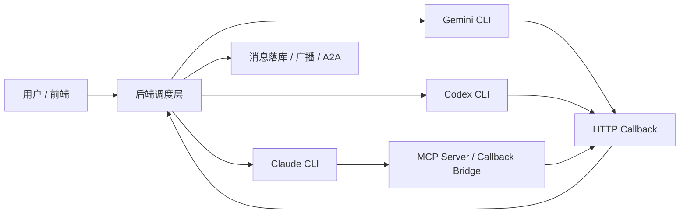
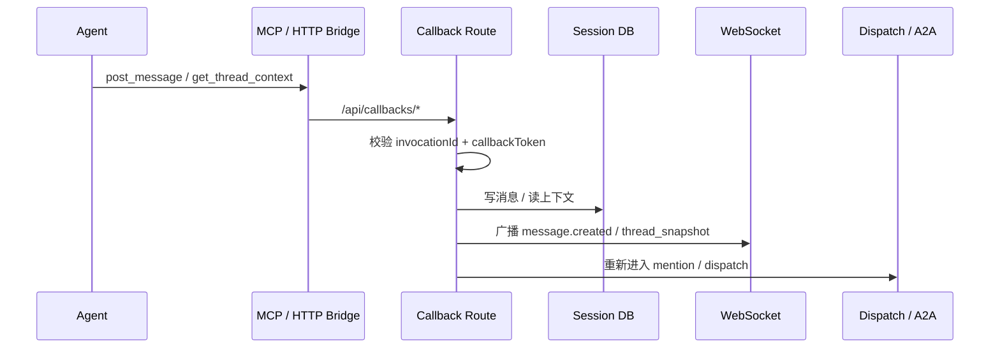
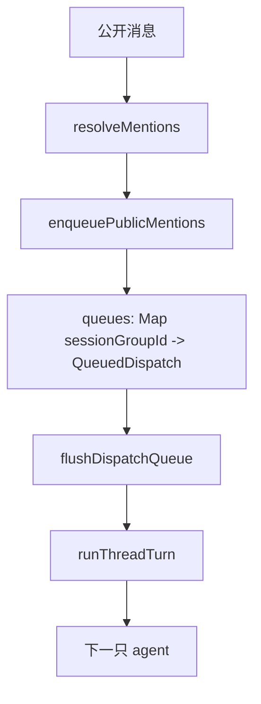

# MCP / Callback 实现对比

本文对比两个实现：

- 参考实现：`cat-cafe-tutorials` 的 [`05-mcp-callback.md`](https://github.com/zts212653/cat-cafe-tutorials/blob/main/docs/lessons/05-mcp-callback.md)
- 当前项目：`Multi-Agent`

目标不是判断谁“更先进”，而是把两边的架构意图、工程取舍、当前差异讲清楚。

---

## 一句话结论

两边的核心路线几乎一致：

- `Claude` 走原生 `MCP`
- `Gemini / Codex` 走 prompt 注入的 callback HTTP 调用
- 最终统一回到后端 callback 路由

当前项目可以理解为：

**把 cat-cafe 这套“双轨回传架构”做了一个更收敛、更窄、更偏当前业务闭环的实现。**

---

## 先看共同骨架



两边都不是“模型直接写数据库”。

中间一定会经过一层桥：

- Claude：通过原生 MCP 工具调桥
- Gemini / Codex：通过 HTTP callback 调桥

桥再把请求送回后端，后端负责：

- 鉴权
- 落库
- 广播给前端
- 重新进入调度链路

---

## 对比总表

| 维度 | cat-cafe 教程方案 | 当前项目方案 |
|---|---|---|
| 总体思路 | 双轨：`Claude 原生 MCP` + `Gemini/Codex prompt 注入 callback` | 同样是双轨：`Claude 原生 MCP` + `Gemini/Codex callback prompt` |
| Claude 挂载方式 | 通过 `--mcp-config` 动态挂载 MCP | 也是 `--mcp-config`，但先写临时 JSON 文件，再把路径传给 Claude |
| Claude 工具约束 | 教程重点在“如何动态挂上” | 当前项目额外加了 `--strict-mcp-config` 和 `--allowedTools mcp__multi_agent_room__*`，权限更收口 |
| 非 Claude 兜底 | prompt 里教 AI 用 `curl` 调 callback | prompt 里教 AI 用 Node `fetch` 调 callback |
| callback 能力面 | 文中展示为较丰富的平台能力 | 当前只开放了较小的一组能力 |
| 原生 MCP 暴露工具 | 教程是能力平台视角，工具面更容易继续扩展 | 当前只暴露 `post_message`、`get_thread_context` 两个工具 |
| 回传认证 | `invocationId + callbackToken` 双 UUID | 完全同一套思路 |
| 回流后的后端处理 | 统一 callback 基础设施 | 落库、广播、A2A 继续调度，和会话模型强绑定 |
| 生命周期 | 强调“动态挂载，进程结束即消失” | 同样按 invocation 临时生成 / 临时清理 |
| 会话模型 | 更偏“猫能主动开口说话”的机制设计 | 更偏“线程、房间、A2A、共享上下文”的工程实现 |

---

## cat-cafe 更强调的点

从教程文本看，cat-cafe 更强调三个设计命题：

### 1. Agent 不是 API

教程把“猫要主动开口说话”当成第一原则。

这背后的设计是：

- CLI 输出默认是 agent 的内部过程
- `post_message` 才是 agent 主动对房间公开发言

也就是说，教程更强调“主动性”和“隐私边界”。

### 2. Dynamic MCP 是唯一正确挂法

教程专门对比了三种挂法：

- User 级
- Project 级
- Dynamic 级

它的结论是：

- User 级会污染其他项目
- Project 级在跨项目工作时失效
- 只有 Dynamic 挂载既干净，又不污染外部环境

这个观点和当前项目的方向是一致的。

### 3. callback 平台是后续能力扩展的底座

教程里 callback 不只是“发消息”。

它已经把 callback 看成统一能力平台，后续还能挂：

- `pending-mentions`
- `update-task`
- `request-permission`
- `search-evidence`
- `reflect`
- `retain-memory`

也就是说，cat-cafe 不是只把 callback 当“聊天室发言接口”，而是当“Agent 执行期间的外部能力总线”。

---

## 当前项目更强调的点

当前项目的实现重点不在“平台故事”，而在“这轮任务先稳定跑起来”。

### 1. Claude 的原生 MCP 非常收口

Claude 当前启动参数在 [`packages/api/src/runtime/claude-runtime.ts`](/C:/Users/-/Desktop/Multi-Agent/packages/api/src/runtime/claude-runtime.ts)：

- `--strict-mcp-config`
- `--allowedTools mcp__multi_agent_room__*`

含义是：

- 本轮只认这次临时传入的 MCP 配置
- 本轮只放行 `multi_agent_room` 这一个 MCP server 的工具

这比教程里展示的“动态挂上即可”更保守。

优点：

- 权限边界清楚
- 不容易混入用户自己的别的 MCP 配置
- Claude 的工具面更可控

代价：

- 扩展工具时要同步改白名单和 server 定义

### 2. 当前项目的 MCP tool 面很小

当前本地 MCP server 在 [`packages/api/src/mcp/server.ts`](/C:/Users/-/Desktop/Multi-Agent/packages/api/src/mcp/server.ts) 里只暴露两个工具：

- `post_message`
- `get_thread_context`

也就是说，现在 Claude 的原生 MCP 更像是：

**“房间发言 + 最近上下文读取”**

而不是一个完整 callback 平台。

### 3. callback 和会话模型是深绑定的

当前项目里 callback 一旦成功，就不只是“接口返回 200”。

它会立即进入这一串流程：



这意味着当前项目的 callback 不是一个独立平台模块，而是会直接卷入：

- `session_group`
- `thread`
- `timeline`
- `dispatch queue`
- `A2A mention`

这在工程上更紧耦合，但也更直接。

---

## A2A 实现对比

这一节只看一件事：

**agent 之间互相 `@` 之后，下一跳到底是怎么被触发、怎么被约束、怎么被停止的。**

如果只看结论：

- `cat-cafe` 的 A2A 是从“双路径”一路踩坑，最后收敛回“统一 worklist”
- 当前项目的 A2A 从第一版就更接近“统一队列 + 单执行入口”

这也是为什么两边在理念上很像，但工程稳定性起点不一样。

---

## cat-cafe 的 A2A：早期是两条路径

根据 `cat-cafe-tutorials` 第四课《多猫路由》，它的 A2A 不是从一开始就只有一条执行链，而是自然长出了两条路径。

### 路径 A：Worklist 链

最早的 A2A 很直接：

- 一只猫执行完
- 检查它最终回复文本里有没有 `@另一只猫`
- 如果有，就把目标猫追加到 `worklist`
- worklist 再继续跑下一只猫

教程里明确提到这条路的几个关键实现特征：

- 先剥离代码块，避免代码示例里的 `@mention` 误触发
- 对 agent 回复用**行首匹配**
- 不能 `@` 自己
- 通过 `a2aCount < maxDepth` 控制深度
- 整条 worklist 链共享一个 `AbortController`

所以它的控制流更像：

```text
猫 A 跑完
  -> parseA2AMentions(最终回复)
  -> worklist.push(猫 B)
  -> worklist 继续执行猫 B
```

### 路径 B：Callback 触发

后来又长出了第二条路径。

原因是猫不一定只会在“最终回复”里 `@` 另一只猫，也可能在执行过程中通过 MCP callback 主动发一条公开消息，例如：

```text
分析完了，@缅因猫 帮我看看修复方案对不对
```

于是 callback 路由收到 `post_message` 后，也会检测其中的 mention，并直接触发下一次 A2A。

教程里把这条路单独抽成了一个 callback 触发器。它和 worklist 的根本差异不是“也是 mention 触发”，而是：

- Path A：把目标猫追加到父链 worklist，继续串行执行
- Path B：直接在后台独立拉起新的执行链，和父链并行跑

可以简化成：

```text
Path A:
  最终回复 mention -> push 到 worklist -> 串行继续

Path B:
  callback 公开消息 mention -> 独立 routeExecution() -> 并行继续
```

这个“双路径”设计就是后面事故的根因。

---

## cat-cafe 早期踩到的 3 个坑

第四课里复盘了一个 P0 事故，文中直接引用了这些证据名：

- `bug report 2026-02-14-a2a-feedback-loop`
- `bug report 2026-02-14-a2a-callback-chain-blocked`
- `BACKLOG #28`

即使不单独打开 issue 页面，教程正文本身已经把问题链说清楚了。

### 1. 双重开火

同一段 `@opus` 文本可能同时被两套检测器各捕获一次：

1. callback `post_message("@opus ...")` 被 Path B 看见
2. 这段文本最终也进入 CLI 的完整输出，又被 Path A 看见

结果是：

- 同一个 mention
- 两条路径各触发一次
- 两个目标 agent 实例并发拉起

这就是教程里说的“同一段 `@opus` 被两个检测器各看到一次”。

### 2. 无限递归

Path A 有统一深度保护：

- `a2aCount < maxDepth`

Path B 当时没有统一深度计数。

于是猫 A callback `@` 猫 B，猫 B 再 callback `@` 猫 A 时，就可能形成无限来回触发。

教程把这类现象直接叫做“无限乒乓”。

### 3. 不可取消

教程里提到 callback 路径拉起的 child invocation 没有很好地纳入统一 tracker。

于是用户点 Stop 时：

- 父调用能停
- callback 独立拉起的 child 可能还在后台跑

这就是为什么当时会出现“按了 Stop 也停不下来，最后只能重启服务”的体验。

---

## cat-cafe 后来的修复方向：F27 路径统一

cat-cafe 最终不是继续补两条路径，而是把 callback 路径“降格”成只负责入队。

也就是：

- callback 收到公开 mention
- 不再自己独立 fire-and-forget 地启动下一条执行链
- 只负责把目标猫重新追加到父 worklist

修完后的控制流变成：

```text
猫 A 执行中
  -> callback post_message("@猫B")
  -> callback 检测 mention
  -> 只做 worklist.push(猫B)
  -> 不自己启动新链
  -> 猫 A 跑完
  -> 父 worklist 再继续执行猫 B
```

所以 cat-cafe 的 A2A 演化路线其实很清晰：

1. 先有串行 worklist
2. callback 需求长出第二条独立触发路径
3. 双路径导致双重开火、无限递归、不可取消
4. 最终重新统一回 worklist 唯一执行入口

这个演化过程本身就是很有价值的工程教训。

---

## 当前项目的 A2A：单队列、单入口、串行接力

当前项目没有照搬 cat-cafe 的 worklist 写法，但最后落到的控制原则，实际上更接近 cat-cafe 修完之后的形态。

关键代码在：

- [`packages/api/src/orchestrator/mention-router.ts`](/C:/Users/-/Desktop/Multi-Agent/packages/api/src/orchestrator/mention-router.ts)
- [`packages/api/src/orchestrator/dispatch.ts`](/C:/Users/-/Desktop/Multi-Agent/packages/api/src/orchestrator/dispatch.ts)
- [`packages/api/src/services/message-service.ts`](/C:/Users/-/Desktop/Multi-Agent/packages/api/src/services/message-service.ts)

当前项目的 A2A 基本模型是：

- 公开消息出现
- mention 解析
- 生成 `QueuedDispatch`
- 按 `sessionGroupId` 放入队列
- 只有当前会话组空闲时才真正启动下一跳

控制流是：



这里最关键的一点是：

**无论 mention 来自哪里，最终都不会直接绕过队列去私自启动另一条执行链。**

当前 mention 来源有三类：

- 用户消息
- agent 最终回复
- agent callback `post-message`

但它们最终都会统一归入：

- `enqueuePublicMentions(...)`
- `takeNextQueuedDispatch(...)`
- `flushDispatchQueue(...)`

这就是当前项目从结构上避免 cat-cafe 早期双路径问题的根本原因。

---

## 当前项目如何规避 cat-cafe 早期那三个问题

### 1. 避免双重开火：统一只入队，不直接执行

当前项目里 callback 公开消息当然也会触发 mention 解析，但它不会像 cat-cafe 早期 Path B 那样，自己 fire-and-forget 地拉起 child invocation。

它只会：

- `enqueuePublicMentions(...)`

真正执行下一跳的权力，统一留给：

- `flushDispatchQueue(...)`

同时 `DispatchOrchestrator` 里还有：

- `messageTriggeredProviders`

用于记录：

**同一条 messageId 已经触发过哪些目标 provider**

这样即使同一条公开消息内部出现重复 mention，也不会对同一 provider 重复入队。

### 2. 避免无限递归：统一在 root 维度做 hop 计数

当前项目在 `DispatchOrchestrator` 里维护：

- `rootHopCounts`
- `MAX_HOPS = 10`

注意它的计数粒度不是“某条路径自己的局部计数”，而是：

**同一个 rootMessageId 下整条协作链的统一 hop 预算。**

这意味着无论 mention 来源是：

- 用户消息
- agent 最终回复
- callback 公开消息

只要它属于同一条协作链，就消耗同一个 root hop 额度。

这和 cat-cafe 早期“Path A 有上限、Path B 没有统一上限”是本质不同的。

### 3. 避免不可取消：没有第二套后台独立执行态

当前项目的 stop 粒度是 thread 上的当前运行 invocation：

- `stop_thread`
- `invocations.get(threadId)?.cancel()`

虽然它现在还没有“顺手清空未来未执行 hop”的显式队列控制语义，但它至少没有出现 cat-cafe 早期那种：

**后台偷偷跑一条 tracker 根本看不到的 callback child invocation**

因为下一跳还是统一通过：

- `runThreadTurn(...)`
- `InvocationRegistry`

来启动和管理的。

这意味着当前项目的停止模型虽然不算最细，但运行态是收口的。

---

## mention 解析：两边方向一致，但 cat-cafe 更谨慎

### cat-cafe 的做法

第四课明确提到：

- 先剥离 fenced code block
- 再做行首匹配

目的是避免：

- 代码示例里的 `@mention`
- 句中普通提及

被误判成真正的 A2A 路由指令。

### 当前项目的做法

当前项目在 [`mention-router.ts`](/C:/Users/-/Desktop/Multi-Agent/packages/api/src/orchestrator/mention-router.ts) 里也采用了严格匹配：

- 只匹配行首
- 允许前面有空白和 markdown 格式字符
- 支持 alias / provider / 首字母大写 provider

但当前项目**还没有先整体剥离代码块**。

这意味着像下面这种内容理论上仍然有误触发空间：

```md
```ts
// @codex review this patch
```
```

所以在 mention 解析这件事上：

- 两边都是“严格匹配派”
- cat-cafe 的误触发防线更完整
- 当前项目还可以补一层“先剥代码块”

---

## A2A 和会话模型的关系：两边关注点不同

这一点必须连着 cat-cafe 第八课一起看。

### cat-cafe 的主问题：同一只猫如何跨多个 session 延续自己

第八课《Session 管理》里，cat-cafe 的重点是：

- 同一个 thread 里，一只猫会有多个 session
- context 满了要 rollover
- 新 session 通过 transcript / digest / session_search 继续理解旧 session

它更像这种模型：

```text
一个 thread
  -> 同一只猫的 Session 1
  -> 同一只猫的 Session 2
  -> 同一只猫的 Session 3
```

所以 cat-cafe 的“连续性”重点在：

- 单猫 session chain
- 防止 session 跨 thread 污染
- 如何让新 session 读懂旧 session

### 当前项目的主问题：多只猫如何在同一个房间里接力

当前项目的主数据模型是：

- 一个 `session_group`
- 下面默认有多条 `thread`
- 每条 thread 对应一个 provider / agent

所以它从一开始就在解决的是：

- 多 thread 之间的公开消息协作
- 同一房间里的共享上下文
- 按 `sessionGroupId` 串行调度

这导致 A2A 的重心不同：

- cat-cafe 早期更像“在同一个 thread 内继续追加下一只猫”
- 当前项目更像“在同一个房间内，从一条 thread 接力到另一条 thread”

因此当前项目的 A2A 队列天然是：

- `sessionGroupId` 级

而不是单一 thread worklist。

---

## A2A 对比总表

| 维度 | cat-cafe 早期 | cat-cafe 修复后 | 当前项目 |
|---|---|---|---|
| 执行入口 | 两条：worklist + callback 独立触发 | 统一回 worklist | 统一回 `QueuedDispatch[]` |
| callback 角色 | 既是事件源，又直接拉执行链 | 只负责入队 | 只负责入队 |
| 深度限制 | worklist 有，callback 路径没有统一计数 | 统一受控 | 统一 `rootHopCounts + MAX_HOPS` |
| 取消能力 | callback child 可能不可取消 | 回归统一父链控制 | 统一由 `InvocationRegistry` 管理当前运行态 |
| 并发风险 | 高，容易双重开火 | 明显下降 | 低，同一 session group 串行 |
| mention 解析 | 剥代码块 + 行首匹配 | 同 | 行首匹配，未剥代码块 |
| 调度粒度 | thread 内 worklist | thread 内 worklist | `sessionGroupId` 队列 |
| 主会话模型 | 单猫 session / thread 连续性 | 同 | 多 agent room / 多 thread 接力 |

---

## A2A 小结

从 A2A 角度看，cat-cafe 给出的最大价值不是“具体代码怎么写”，而是它已经替我们踩过一遍坑：

- 双路径执行入口一定会失控
- callback 不能既当事件源又当执行器
- 深度限制必须覆盖所有触发来源
- 取消能力必须统一纳管

当前项目最大的好处是：

**直接站在这些教训之后，从一开始就把 mention 触发收口成“统一入队、统一出队、统一计数”的模型。**

所以：

- cat-cafe 在“事故复盘和教训沉淀”上更成熟
- 当前项目在“当前 A2A 主链是不是已经收口”这件事上，其实起点比 cat-cafe 早期版本更好

---

## 当前项目里，MCP 到底是怎么工作的

这一节专门用当前项目的真实代码说明。

### 第 1 步：先生成 invocation 身份

在 [`packages/api/src/services/message-service.ts`](/C:/Users/-/Desktop/Multi-Agent/packages/api/src/services/message-service.ts) 里，启动一轮 agent 前会创建 invocation：

- `invocationId`
- `callbackToken`
- `threadId`
- `agentId`
- `expiresAt`

生成逻辑在 [`packages/api/src/orchestrator/invocation-registry.ts`](/C:/Users/-/Desktop/Multi-Agent/packages/api/src/orchestrator/invocation-registry.ts)。

这套身份的作用是：

- 标识“这一轮是谁”
- 限定 callback 只能在这轮运行期内使用

### 第 2 步：把 callback 身份放进环境变量

后端在 [`packages/api/src/runtime/cli-orchestrator.ts`](/C:/Users/-/Desktop/Multi-Agent/packages/api/src/runtime/cli-orchestrator.ts) 里把这些值放进 env：

- `MULTI_AGENT_API_URL`
- `MULTI_AGENT_INVOCATION_ID`
- `MULTI_AGENT_CALLBACK_TOKEN`

这些 env 会随着 CLI 子进程一起传下去。

### 第 3 步：Claude 生成临时 MCP 配置

在 [`packages/api/src/runtime/claude-runtime.ts`](/C:/Users/-/Desktop/Multi-Agent/packages/api/src/runtime/claude-runtime.ts) 里，每次 Claude invocation 都会生成一份临时 `.json`：

```json
{
  "mcpServers": {
    "multi_agent_room": {
      "command": "node",
      "args": [".../mcp/server.js"],
      "env": {
        "MULTI_AGENT_API_URL": "...",
        "MULTI_AGENT_INVOCATION_ID": "...",
        "MULTI_AGENT_CALLBACK_TOKEN": "..."
      }
    }
  }
}
```

然后 Claude 启动时带上：

- `--mcp-config <这个临时文件>`
- `--strict-mcp-config`
- `--allowedTools mcp__multi_agent_room__*`

### 第 4 步：Claude CLI 自己拉起 stdio MCP server

当前项目并不是 Fastify 直接 host 一个 MCP 服务端口。

`MCP server` 本体是 [`packages/api/src/mcp/server.ts`](/C:/Users/-/Desktop/Multi-Agent/packages/api/src/mcp/server.ts) 这个本地进程。

它通过：

- `stdin` 接收 JSON-RPC 请求
- `stdout` 返回 JSON-RPC 响应

这是一个标准的 `stdio MCP server` 思路。

### 第 5 步：MCP server 再去调 callback HTTP 接口

这个 server 本身不直接写数据库。

它做的事情是：

- `post_message` -> 调 `/api/callbacks/post-message`
- `get_thread_context` -> 调 `/api/callbacks/thread-context`

也就是说：

**MCP server 其实只是“Claude -> callback 路由”的本地桥。**

### 第 6 步：callback 路由校验并回流业务链

callback 路由在 [`packages/api/src/routes/callbacks.ts`](/C:/Users/-/Desktop/Multi-Agent/packages/api/src/routes/callbacks.ts)。

它会做：

1. 校验 `invocationId + callbackToken`
2. 找到对应 thread
3. 持久化消息或读取上下文
4. 广播给前端
5. 重新触发 dispatch / A2A

这一步是“桥接层”和“业务层”的真正接缝。

---

## 和 cat-cafe 的最大差异：我们还没把 callback 平台做大

这是两边现在最本质的差异。

### cat-cafe 的视角

教程里 callback 已经是平台：

- 发消息
- 读上下文
- 查待办 mention
- 更新任务
- 请求授权
- 检索证据
- 做反思
- 沉淀记忆

它强调的是：

**“只要能拿到 invocation 身份，Agent 在执行中就能访问越来越多的外部协作能力。”**

### 当前项目的视角

当前项目的 callback 仍然主要服务于：

- 房间公开发言
- 读取最近上下文
- 继续 A2A 接力

所以你现在看到的效果更像：

**一个为聊天室协作服务的最小回传闭环**

而不是一个成熟的 agent capability platform。

---

## 为什么当前项目还没有把 `pending-mentions` 做进 Claude 原生 MCP

这点很典型。

callback 路由已经有：

- `/api/callbacks/pending-mentions`

但本地 MCP server 只暴露：

- `post_message`
- `get_thread_context`

这说明当前项目的设计思路是：

- 先把最基础、最稳定的协作动作做通
- 没有把所有 callback 能力一股脑暴露给 Claude

可能的考虑包括：

- 降低工具面，减少模型误用
- 保持当前 prompt 和工具心智模型简单
- 先验证 A2A / 时间线 / callback 基础链路

但从对比角度看，这也是当前项目和 cat-cafe 最明显的“成熟度差距”之一。

---

## 两边的运行时差异

虽然 callback 架构接近，但运行时风格不完全一样。

### 先回答一个最容易误解的问题：CLI 进程是不是常驻保活？

结论：

- `cat-cafe`：从教程证据看，**不是常驻进程**，而是每次 invocation `spawn` 一次 CLI，再通过 `sessionId` / `resume` 延续原生会话
- 当前项目：**也不是常驻进程**，同样是每轮 `spawn` 一个新的 CLI 子进程，再通过 `nativeSessionId` 续上原生会话

也就是说，两边的共同模式都是：

**“进程短命，session 长命。”**

不是：

**“一个 CLI 进程一直活到整场会话结束。”**

### cat-cafe：每次 invoke 都是新的 CLI 子进程

根据 `cat-cafe-tutorials` 第一课《从 SDK 到 CLI》里的代码和叙述，它在迁移到 CLI 后的核心写法是：

- `spawnCli({ command: 'claude', args })`
- 如果已有 `sessionId`，则附加 `--resume`

教程里明确写了两个关键信号：

1. 从 SDK 改成了 `spawnCli({ command: 'claude' })`
2. `if (options?.sessionId) { args.push('--resume', options.sessionId) }`

这说明 cat-cafe 的运行模型是：

```text
每次 invoke
  -> spawn 一个新的 CLI 进程
  -> 如果已有 sessionId，就 resume
  -> 跑完退出
```

所以它保活的不是“本地进程”，而是“CLI 自己的原生会话”。

### cat-cafe 为什么还会讨论 Session Chain

第八课《Session 管理》进一步说明了这一点。

如果 CLI 进程是永久常驻，其实不会那么强调：

- session 满了如何 seal
- Session 1 / Session 2 / Session 3
- `resume X`
- 旧 session transcript 如何被新 session 读取

cat-cafe 恰恰非常强调这些，说明它的连续性不是靠“进程永远活着”，而是靠：

- CLI 的原生 session id
- 以及在 context 满了之后，切换到下一代 session

所以 cat-cafe 的模型更准确地说是：

```text
短命 CLI 进程
  + 可恢复的原生 session
  + 当原生 session 过长时，再切成 session chain
```

### 当前项目：每一轮回复都重新 spawn

当前项目的证据更直接，代码就在本地：

- [`packages/api/src/runtime/base-runtime.ts`](/C:/Users/-/Desktop/Multi-Agent/packages/api/src/runtime/base-runtime.ts)
- [`packages/api/src/runtime/claude-runtime.ts`](/C:/Users/-/Desktop/Multi-Agent/packages/api/src/runtime/claude-runtime.ts)
- [`packages/api/src/runtime/gemini-runtime.ts`](/C:/Users/-/Desktop/Multi-Agent/packages/api/src/runtime/gemini-runtime.ts)
- [`packages/api/src/runtime/codex-runtime.ts`](/C:/Users/-/Desktop/Multi-Agent/packages/api/src/runtime/codex-runtime.ts)

`BaseCliRuntime.runStream()` 里每次都会直接：

- `spawn(command.command, command.args, ...)`

也就是说，每次 `runTurn()` 都会拉起一个新的 CLI 子进程。

当前项目三家的续会话方式分别是：

- Claude：`--resume <nativeSessionId>`
- Gemini：`--resume <nativeSessionId>`
- Codex：`exec resume ... <nativeSessionId>`

这意味着当前项目的实际模型是：

```text
用户发一条消息
  -> 后端 spawn 一次 CLI
  -> CLI 输出本轮结果
  -> 进程退出
  -> 保存 nativeSessionId

下一轮消息
  -> 再 spawn 一次新的 CLI
  -> 用 nativeSessionId resume
```

### 这两个项目在“保活”问题上的真正区别，不在于是否常驻，而在于“会话续命层级”

两边都不是单进程常驻。

真正的差别是：

- `cat-cafe`
  - 先靠 CLI 原生 session `resume`
  - context 真满了，再进入 `Session Chain`
  - 新 session 可以通过 transcript / digest / search 去理解旧 session

- 当前项目
  - 目前主要靠 `nativeSessionId` 做单条 thread 的原生 resume
  - 还没有实现 cat-cafe 那种完整的 session chain / sealing / transcript 检索体系

所以：

- 在“本地进程是否保活”这个问题上，两边答案一样：**都不保活**
- 在“会话如何跨长时间任务延续”这个问题上，cat-cafe 比当前项目更成熟

### 为什么两边都没有选择“一个 CLI 进程永久保活”

因为常驻 CLI 虽然更快，但会带来明显更高的工程复杂度：

- 要长期维护 stdin / stdout / stderr 流
- 要处理交互式确认
- 要做多 agent 并发隔离
- 要处理 stop / reconnect / crash recovery
- 三家 CLI 的行为差异更难统一

而“每轮重拉 + resume”虽然有启动开销，但优点很现实：

- 生命周期简单
- 出错边界清晰
- 调度层更容易统一三家 provider
- 资源和清理逻辑更可控

### 这一点对 A2A / MCP 有什么影响

因为两边都不是进程常驻，所以：

- Claude 的原生 MCP 也是**每轮重新挂一次**
- callback 身份也是**每轮重新生成一套**
- 停止、清理、失效逻辑都是按 invocation 级别处理的

这也是为什么这两个项目都很强调：

- `invocationId`
- `callbackToken`
- `sessionId / nativeSessionId`
- `resume`

而不是强调某个常驻 agent daemon。

### cat-cafe 教程更强调“让猫自己会调接口”

教程把 prompt 注入写得比较“显式”：

- 把 `curl` 命令直接写进系统提示词
- 明确告诉 AI 可以自己发 HTTP 请求

这是很典型的“先把 agent 能力做出来”的写法。

### 当前项目更强调“统一 runtime 包装”

当前项目通过：

- `BaseCliRuntime`
- `ClaudeRuntime`
- `GeminiRuntime`
- `CodexRuntime`

把三家 CLI 的差异统一包起来。

这样做的好处是：

- 调度层不需要知道太多 provider 细节
- env 注入和会话恢复逻辑更统一
- 后面扩展 provider 时边界更清楚

这属于更工程化的实现方式。

---

## 当前项目比 cat-cafe 更强的地方

不是所有地方都是“我们少一点”。

有几处当前项目反而更强或更收敛。

### 1. Claude 权限边界更紧

当前项目明确限制了 Claude 本轮只能用：

- `mcp__multi_agent_room__*`

这比“默认让工具都暴露给模型”更稳。

### 2. callback 和会话存储、前端时间线连得更紧

当前项目的 callback 不是一个孤立 API。

它和这些东西直接连在一起：

- SQLite
- timeline message
- activeGroup snapshot
- WebSocket broadcast
- mention dispatch

所以一条 callback 消息发出来后，界面和调度状态会马上联动。

### 3. invocation 生命周期更明确

当前项目把 invocation 看成“短期运行身份”：

- 有 `expiresAt`
- 运行结束会失效
- 每轮重新生成

这让 callback 的安全边界更清晰。

---

## 当前项目比 cat-cafe 弱的地方

### 1. callback 工具面还不够大

这是最明显的。

如果后面要增强 agent 自主性，当前项目最值得补的是：

- `pending_mentions` 的原生 MCP 暴露
- `update_task`
- `request_permission`
- `search_evidence`
- `retain_memory`

### 2. Claude 的 MCP / Gemini/Codex callback 还没有完全统一成一个能力层

现在更像：

- Claude：原生 MCP
- Gemini/Codex：prompt 教学

而不是：

**后端抽象一个“统一能力目录”，不同 provider 只是不同 transport。**

### 3. 还没有形成清晰的“callback 平台文档”

当前项目的逻辑主要散在代码里：

- runtime
- mcp server
- callback routes
- message service

从工程维护角度，后续最好补一份单独文档，把 callback 能力、鉴权、生命周期、transport 差异统一说明。

---

## 如果借鉴 cat-cafe，我们项目最值得补的 5 个点

### 1. 把 callback 当平台，不只是聊天室桥

建议把 callback 从“发消息接口”升级为“执行期能力层”。

### 2. 扩大原生 MCP 暴露面

至少把已有 callback 能力中适合 Claude 的部分补齐：

- `pending_mentions`
- 可能的 `update_task`

### 3. 做一层统一 capability 抽象

理想形态是：

- 逻辑能力名：`post_message`、`get_context`、`pending_mentions`
- Claude transport：MCP
- Gemini/Codex transport：HTTP callback prompt

这样上层不必过度关心 provider 差异。

### 4. 把 callback 平台文档补成正式架构文档

建议单独拆一份：

- transport 层
- 认证层
- callback API 层
- 调度回流层

### 5. 明确哪些能力是“公开发言”，哪些是“内部控制”

后面如果 callback 能力增多，必须分层：

- 对房间可见的公开动作
- 仅调度层可见的控制动作
- 仅安全层可见的高风险动作

---

## 最后一句总结

cat-cafe 的方案更像：

**先把“Agent 在执行中如何主动对外协作”抽象成一套 callback 平台。**

当前项目更像：

**先把“多 agent 房间 + A2A 接力 + 实时时间线”跑通，再用最小 MCP/callback 闭环把 Claude、Gemini、Codex 接回同一条业务链。**

所以：

- 架构方向上，两边高度一致
- 工程成熟度上，cat-cafe 的 callback 平台更展开
- 业务闭环上，当前项目和自己的 `session/thread/A2A` 结合得更直接

---

## 参考

- cat-cafe 教程：<https://github.com/zts212653/cat-cafe-tutorials/blob/main/docs/lessons/05-mcp-callback.md>
- cat-cafe A2A 教程：<https://github.com/zts212653/cat-cafe-tutorials/blob/main/docs/lessons/04-a2a-routing.md>
- cat-cafe Session 教程：<https://github.com/zts212653/cat-cafe-tutorials/blob/main/docs/lessons/08-session-management.md>
- 当前项目 Claude runtime：[claude-runtime.ts](/C:/Users/-/Desktop/Multi-Agent/packages/api/src/runtime/claude-runtime.ts)
- 当前项目 callback prompt：[base-runtime.ts](/C:/Users/-/Desktop/Multi-Agent/packages/api/src/runtime/base-runtime.ts)
- 当前项目 MCP server：[server.ts](/C:/Users/-/Desktop/Multi-Agent/packages/api/src/mcp/server.ts)
- 当前项目 callback routes：[callbacks.ts](/C:/Users/-/Desktop/Multi-Agent/packages/api/src/routes/callbacks.ts)
- 当前项目 invocation registry：[invocation-registry.ts](/C:/Users/-/Desktop/Multi-Agent/packages/api/src/orchestrator/invocation-registry.ts)
- 当前项目 mention 解析：[mention-router.ts](/C:/Users/-/Desktop/Multi-Agent/packages/api/src/orchestrator/mention-router.ts)
- 当前项目 A2A 队列：[dispatch.ts](/C:/Users/-/Desktop/Multi-Agent/packages/api/src/orchestrator/dispatch.ts)
- 当前项目调度执行：[message-service.ts](/C:/Users/-/Desktop/Multi-Agent/packages/api/src/services/message-service.ts)
